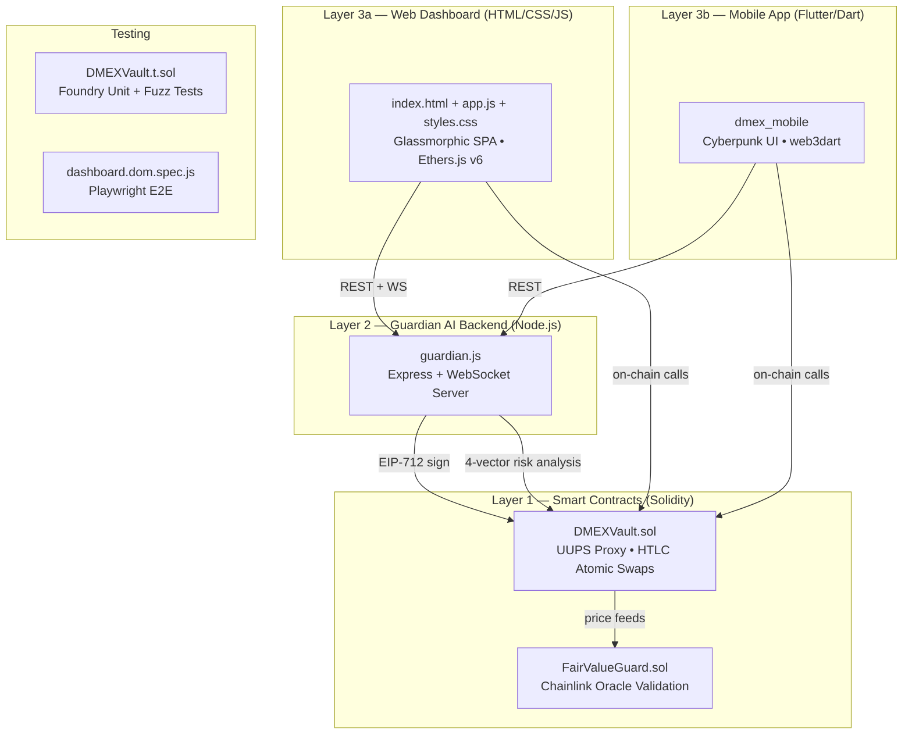
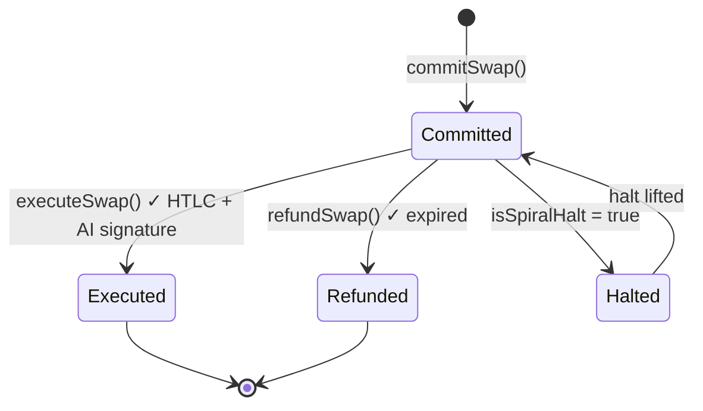
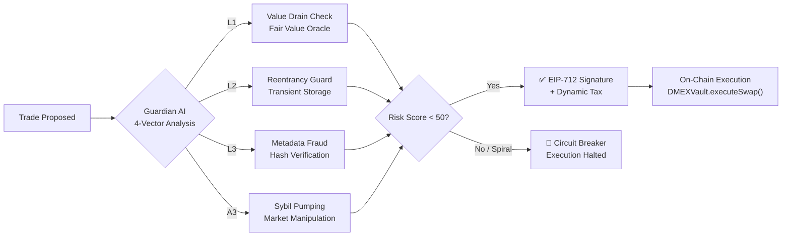

# D-MEX CLAUDE — Full Project Scan Report

> **Project**: D-MEX Protocol — AI-Secured Cross-Asset GameFi Barter Exchange
> **Network**: Scroll Sepolia (Chain ID `534351`)
> **Scanned**: 28 files across 3 technology layers
> **Report Name**: D-MEX CLAUDE

---

## Architecture Overview



---

## File Inventory (28 files)

| # | File | Layer | Type | Size |
|---|------|-------|------|------|
| 1 | `DMEXVault.sol` | Smart Contract | Core Vault (UUPS Proxy) | 14 KB |
| 2 | `FairValueGuard.sol` | Smart Contract | Oracle Guard | 2.6 KB |
| 3 | `DMEXVault.t.sol` | Smart Contract | Foundry Tests | 17 KB |
| 4 | `vault-abi.js` | Smart Contract | ABI + Addresses | 11 KB |
| 5 | `scope.md` | Smart Contract | Audit Scope | 0.6 KB |
| 6 | `invariants.md` | Smart Contract | Protocol Invariants | 2.6 KB |
| 7 | `known-issues.md` | Smart Contract | Known Issues | 2.9 KB |
| 8 | `trust_model.md` | Smart Contract | Trust Model | 2.0 KB |
| 9 | `CHANGELOG.md` | Ops | Change Log | 6.8 KB |
| 10 | `DEPLOYMENT_UPGRADE.md` | Ops | Upgrade Playbook | 3.4 KB |
| 11 | `SETUP_AND_TESTING.md` | Ops | Setup Guide | 3.0 KB |
| 12 | `guardian.js` | Backend | AI Arbiter Server | 55 KB |
| 13 | `index.html` | Web Frontend | SPA Dashboard | 86 KB |
| 14 | `app.js` | Web Frontend | Core Client Logic | 172 KB |
| 15 | `styles.css` | Web Frontend | Design System | 71 KB |
| 16 | `dashboard.dom.spec.js` | Web Frontend | Playwright Tests | 3.7 KB |
| 17 | `main.dart` | Mobile | App Entry Point | 3.4 KB |
| 18 | `pubspec.yaml` | Mobile | Dependencies | 0.5 KB |
| 19 | `app_theme.dart` | Mobile | Theme / Design | 1.8 KB |
| 20 | `bottom_nav.dart` | Mobile | Glass Navigation | 2.7 KB |
| 21 | `dmex_service.dart` | Mobile | Web3 + Guardian Service | 8.9 KB |
| 22 | `analytics_screen.dart` | Mobile | Analytics Dashboard | 12 KB |
| 23 | `cyber_arbiter_screen.dart` | Mobile | Arbiter Terminal | 8.0 KB |
| 24 | `market_screen.dart` | Mobile | Live Barter Board | 9.3 KB |
| 25 | `portfolio_settings_screen.dart` | Mobile | Portfolio & AI Settings | 16 KB |
| 26 | `propose_intent_screen.dart` | Mobile | Swap Engine | 14 KB |
| 27 | `risk_breakdown_screen.dart` | Mobile | Threat Analysis | 12 KB |
| 28 | `D_MEX_PROTOCOL_updated.zip` | Archive | Bundled Protocol | 4.8 MB |

---

## Layer 1 — Smart Contracts (Solidity 0.8.27)

### DMEXVault.sol — Master Vault V3.0

> [!IMPORTANT]
> Core protocol contract — UUPS-upgradeable atomic multi-asset barter vault with HTLC settlement, AI guardian signing, and peg-defense mechanics.

**Inheritance**: `Initializable` → `UUPSUpgradeable` → `Ownable2StepUpgradeable`

**Supported Standards**: ERC-20, ERC-721, ERC-1155 (bundles of 1–20 mixed assets per side)

#### State Architecture
| Variable | Type | Purpose |
|----------|------|---------|
| `swaps` | `mapping(bytes32 ⇒ Swap)` | Primary swap registry |
| `initiatorBundles` | `mapping(bytes32 ⇒ Asset[])` | Escrowed "You Offer" assets |
| `counterpartyBundles` | `mapping(bytes32 ⇒ Asset[])` | Expected "You Receive" assets |
| `priceFeeds` | `mapping(address ⇒ address)` | Token → Chainlink aggregator |
| `guardianSigner` | `address` | Authorized AI signer EOA |
| `protocolTreasury` | `address` | Dynamic tax recipient |

#### Core Swap Lifecycle


1. **`commitSwap()`** — Escrows initiator assets, stores bundle specs, validates counterparty & expiry
2. **`executeSwap()`** — Verifies HTLC secret (`sha256`), validates EIP-191 guardian signature (with chain-specific domain separation), enforces `riskScore < 50`, applies dynamic exit tax (capped 10%), atomically transfers all assets
3. **`refundSwap()`** — Returns escrowed assets to initiator after expiry

#### Security Mechanisms
- **Transient-storage reentrancy guard** (`tload`/`tstore` via EIP-1153) — zero-gas-bloat protection
- **Anti-Spiral Circuit Breaker** — guardian-signed halts block execution immediately
- **EIP-2 signature malleability protection** — enforces low-`s` bound
- **Yul-optimized `safeTransferFrom`** — handles non-standard ERC-20s (e.g., USDT)
- **CEI pattern** — state mutations before external calls

#### Events
`SwapCommitted` · `SwapExecuted` · `SwapRefunded` · `AntiSpiralHaltTriggered` · `GuardianSignerUpdated` · `TreasuryUpdated` · `PriceFeedUpdated`

---

### FairValueGuard.sol — Oracle Validation

Abstract Chainlink Functions client enforcing fair-value trade ratios:
- **`FAIRNESS_THRESHOLD`**: 80% minimum value match between offered/wanted bundles
- **`MAX_STALENESS`**: 1 hour oracle heartbeat freshness limit
- Aggregates ERC-20 prices × amounts + NFT floor prices × counts
- Reverts on zero price, stale feeds, or zero target value

---

### Deployed Addresses (Scroll Sepolia)

| Contract | Address |
|----------|---------|
| **DMEX_VAULT_PROXY** | `0x39B845162051b643F0E883eF3F3382A0164528f0` |
| VAULT_PROXY (Legacy) | `0xbD8c5247504ecA82Dbb6A7C78bE5B55131402dF8` |
| VAULT_IMPL | `0x7C3D4Ce6FACae8F359000daa90378fF9b74D7bf2` |
| DGLD (ERC-20) | Game Gold Token |
| NFT_SWORD (ERC-721) | Game Weapons |
| COMMODITY (ERC-1155) | Game Resources |

---

### Test Coverage (Foundry)

| Test | Type | What It Validates |
|------|------|-------------------|
| `test_barter_with_peg_defense` | Integration | Multi-standard swap with 5% exit tax; verifies final balances across all parties |
| `test_spiral_halt_revert` | Unit | Circuit breaker correctly reverts execution |
| `testFuzz_SignatureReplay` | Fuzz | Domain separation prevents cross-swap signature replay |
| `testFuzz_AtomicExecution` | Fuzz | Zero residual tokens in vault across arbitrary amounts ($10^{18}$–$10^{30}$) |
| `testFuzz_RefundAfterExpiry` | Fuzz | Full asset recovery post-expiry |
| `testFuzz_MultiAssetBundleAtomicity` | Fuzz | Mixed ERC-20/721/1155 atomic execution with no leaks |

**Result**: 8/8 unit/fuzz tests passing · 5/5 invariant tests passing

---

### Protocol Invariants (16 defined)

Key invariants include:
- Single state transition per swap (committed → executed OR refunded, never both)
- Only designated counterparty can execute; only initiator can refund after expiry
- Guardian power bounds: `riskScore < 50`, `dynamicTaxBps ≤ 1000` (10% cap), `isSpiralHalt` blocks execution
- Reentrancy impossible via ERC-721/1155 hooks
- Oracle values must be > 0 and within staleness window

---

## Layer 2 — Guardian AI Backend (`guardian.js`)

> [!IMPORTANT]
> Node.js server (Express HTTP + WebSocket) serving as the AI Arbiter — evaluates trade risk, signs on-chain authorizations, and pushes real-time telemetry.

### Core Capabilities

| Capability | Detail |
|------------|--------|
| **Risk Analysis** | 4-vector scoring: L1 Value Drain, L2 Reentrancy, L3 Metadata Fraud, A3 Sybil Pumping |
| **EIP-712 Signing** | Signs `ArbiterPayload` (riskScore, dynamicTaxBps, isSpiralHalt) for both V1 and V3 contracts |
| **Psychology Engine** | Flags cognitive biases: Endowment Effect, Loss Aversion, Anchoring Bias, FOMO |
| **RPC Failover** | Alchemy WebSocket primary + 4 public HTTP RPC fallbacks |
| **Event Monitoring** | Watches `SwapCommitted`, `SwapExecuted`, `SwapRefunded`, token transfers |
| **Persistence** | Writes all evaluations to `ledger.json` with zero tamper window |

### API Endpoints

| Endpoint | Method | Purpose |
|----------|--------|---------|
| `/api/evaluate` | POST | Evaluate trade risk (UniversalVault V1) |
| `/api/sign` | POST | Sign trade authorization (V1) |
| `/api/dmex/sign` | POST | Evaluate + sign ArbiterPayload (DMEXVault V3) |
| `/api/faucet` | POST | Mint testnet tokens (1000 DGLD, 1 Sword, 50 Commodities) |
| `/api/rpc` | POST | Proxy RPC requests (CORS bypass) |
| `/api/marketplace/live` | GET | Fetch live open swap intents from Scroll Sepolia |
| `/api/analytics` | GET | Guardian health & analytics data |

---

## Layer 3a — Web Dashboard (`index.html` + `app.js` + `styles.css`)

> [!TIP]
> Spotify-inspired Glassmorphic SPA with Ethers.js v6, supporting MetaMask, Direct RPC burner wallet, and ERC-4337 smart wallet context.

### Design System
- **Theme**: Dark mode default with light mode + system-sync support
- **Style**: Glassmorphism (`backdrop-filter: blur(24px)`), rounded pills, neon accents
- **Colors**: Teal accent (`#0f9d8e`), pitch black backgrounds, semantic reds/yellows/purples
- **Animations**: `pulse`, `fadeIn`, `dropIn` keyframes

### Dashboard Sections (6 Tabs)

| Tab | Key Features |
|-----|--------------|
| **Propose Intent** | Asset offer/receive cards, counterparty input with reputation preview, swap suggestions, Sign & Execute buttons |
| **Marketplace** | Demo vs Live (on-chain events) toggle, game filters (D-MEX, Loot, Gods, CryptoKitties, CS2, UGC), asset type filters, search & sort |
| **Peer Discovery** | Trust-based peer filtering, trader discovery cards, recent associates, in-chat negotiation with calculator |
| **Game Studio** | CS2 Steam skin importer (float/sticker metadata), UGC 3D asset creator (Unreal/Blender/Maya/Unity) |
| **Order History** | Open orders on Scroll Sepolia, recent swap history |
| **Analytics** | KPI metrics, Safety Ratio donut chart, Composite Risk line chart, Attack Node breakdown, Evaluation History table, JSON/CSV export |

### Overlays & Modals
- Guardian telemetry panel (velocity, volatility, exit tax, live terminal)
- ATM-style swap verification modal
- AI Intervention warning overlay
- 2FA code verification modal
- Welcome toast, peer chat widget, portfolio modal

### Wallet Support
| Wallet Type | Details |
|-------------|---------|
| MetaMask | Browser extension, Scroll Sepolia auto-network switch |
| Direct RPC | Testnet burner wallet for automated testing |
| Smart Wallet | ERC-4337 mock context |

---

## Layer 3b — Flutter Mobile App (`dmex_mobile`)

> [!TIP]
> Cyberpunk/terminal-styled mobile DEX client with `web3dart`, glassmorphism navigation, and 6 screens.

### Design System
- **Color Palette**: Obsidian black (`#0E0E0E`), slate surface (`#191919`), neon cyan accent (`#0F9D8E`), coral warning (`#FF7162`)
- **Typography**: Space Grotesk (headings), Manrope (body), JetBrains Mono (terminal/logs)
- **Navigation**: Floating glassmorphic bottom nav with Gaussian blur and neon glow active indicators

### Dependencies
`web3dart` · `http` · `web_socket_channel` · `flutter_dotenv` · `crypto` · `google_fonts` · `provider`

### Screens (6 total)

| Screen | Purpose | Key Features |
|--------|---------|--------------|
| **Propose Intent** | Swap creation engine (Intent Engine V4.0) | Interactive offer/receive cards, DGLD peg indicator, 2-step commit→execute on-chain flow |
| **Market Board** | Live barter listings | Network velocity/security metrics, active swap cards with trade pairs, mempool logs |
| **Analytics** | System performance dashboard | Bento KPI grid, circular safety gauge, composite risk chart, Arbiter telemetry |
| **Portfolio & Settings** | User identity & AI config | Auto-reject toggle, slippage slider (0–5%), reputation card, AI reasoning toast |
| **Cyber Arbiter** | Guardian terminal | Defense Matrix status, security toggles (Heuristic/Circuit Breaker/Sybil), intervention log |
| **Risk Breakdown** | Threat vector analysis | 4 attack vector score cards, evaluation history table, live node telemetry feed |

### Service Layer (`dmex_service.dart`)
- `commitSwap()` → on-chain HTLC commitment to `DMEXVault`
- `requestGuardianSignature()` → REST call to `/api/dmex/sign`
- `executeSwap()` → on-chain execution with HTLC secret + AI signature
- SHA-256 HTLC secret generation via `crypto` package

---

## Security Architecture



### Trust Boundaries
| Actor | Trust Level | Powers |
|-------|-------------|--------|
| Contract Owner | Privileged | Sets guardian, treasury, price feeds; initiates UUPS upgrades |
| Guardian Signer | Privileged (off-chain) | Signs risk scores, dynamic tax, halt flags — cannot pull funds |
| Initiator / Counterparty | Untrusted | Permissionless swap participants |
| Chainlink Oracles | Trusted-but-verified | External price feeds with staleness/positivity checks |

### Known Issues & Mitigations
| Issue | Status | Mitigation |
|-------|--------|------------|
| Single EOA owner key | ⚠️ Open | Multisig migration planned for production |
| Single EOA guardian signer | ⚠️ Open | Multisig migration planned for production |
| Simple ratio tiering for risk scores | ⚠️ Open | Full dynamic peg-defense math in future iteration |
| Zero-price oracle feeds | ✅ Resolved | Added positivity + staleness checks |
| EIP-191 domain separation | ✅ Resolved | Added `chainid` + `address(this)` |
| Zero-address counterparty | ✅ Resolved | Added validation in `commitSwap` |

---

## Operational Commands

```bash
# Smart Contracts (Foundry)
npm install && forge build && forge test

# Guardian Bot + Dashboard (serves on :3000)
cd guardian && npm install && node guardian.js

# Mobile App (Flutter)
cd mobile && flutter pub get && flutter analyze && flutter run

# E2E Tests (Playwright)
npx playwright test tests/dashboard.dom.spec.js
```

### UUPS Proxy Upgrade Flow
1. `forge build` — compile updated implementation
2. `forge create` — deploy new logic contract
3. `cast send` — call `upgradeToAndCall(newImpl, "")` on proxy via owner key
4. Restart `guardian.js` and redeploy dashboard

---

## Technology Stack Summary

| Layer | Technologies |
|-------|-------------|
| **Smart Contracts** | Solidity 0.8.27 · OpenZeppelin (UUPS, Ownable2Step) · Chainlink · Foundry |
| **Backend** | Node.js · Express · WebSocket · Ethers.js · EIP-712 signing |
| **Web Frontend** | Vanilla HTML/CSS/JS · Ethers.js v6 · Glassmorphism · Canvas charts |
| **Mobile** | Flutter/Dart · web3dart · Google Fonts · Provider |
| **Testing** | Foundry (unit + fuzz) · Playwright (E2E DOM) |
| **Network** | Scroll Sepolia L2 (Chain ID 534351) · Alchemy RPC |

---

> **D-MEX CLAUDE** — Project scan complete. 28 files analyzed across 3 layers. Protocol is functional on Scroll Sepolia testnet with passing test suites and comprehensive security documentation.
