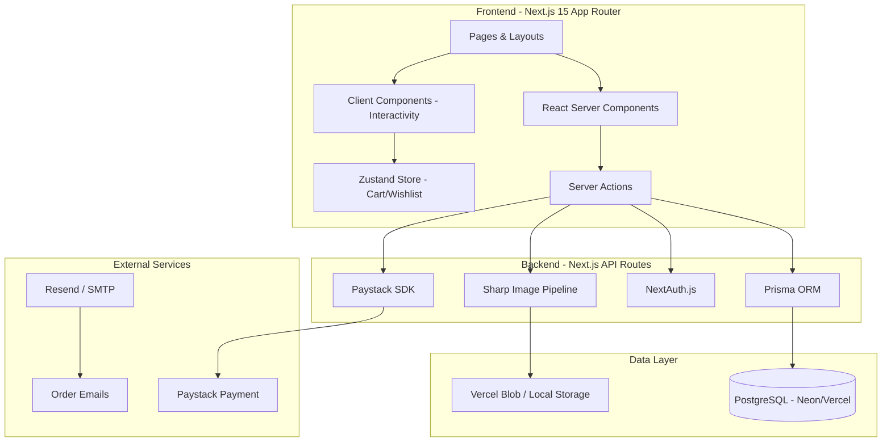

# ANTHO — Premium Nigerian Clothing Brand E-Commerce Website

Build a production-ready, editorial-grade e-commerce website for **ANTHO**, a premium Nigerian clothing brand targeting fashion-forward Nigerians and global buyers.

Visual inspiration drawn from [kagearchvs.xyz](https://www.kagearchvs.xyz/) — dark editorial mood, cinematic hero imagery, generous spacing, bold typography, minimal UI with striking motion. We recreate the *vibe*, not the clone.

---

## User Review Required

> [!IMPORTANT]
> **Payment Gateway**: This plan uses **Paystack** (Nigeria's leading payment gateway). You'll need a Paystack account and API keys. Confirm this is acceptable, or specify an alternative (Flutterwave, etc.).

> [!IMPORTANT]
> **Deployment Target**: Plan targets **Vercel** for deployment with **Vercel Blob** for image storage and **Vercel Postgres** (Neon) for the database. Confirm this is acceptable, or specify an alternative (Railway, DigitalOcean, AWS, etc.).

> [!IMPORTANT]
> **Domain & Brand Assets**: Do you have a domain, logo, brand imagery, or product photos ready? The build will include generated placeholder imagery and sample product data that you can swap out.

> [!WARNING]
> **Admin Authentication**: The admin panel uses **NextAuth.js** with credential-based login (email + password). For production, consider adding 2FA. The initial admin account is seeded via environment variables.

---

## Open Questions

1. **Paystack vs Flutterwave** — Which payment gateway do you prefer? (Plan defaults to Paystack)
2. **Deployment platform** — Vercel, Railway, or self-hosted? (Plan defaults to Vercel)
3. **Email service** — Do you have a preferred transactional email provider (Resend, SendGrid, etc.) for order confirmations and newsletters?
4. **WhatsApp Business number** — Do you have a WhatsApp Business number for the contact widget?
5. **Shipping partners** — Any specific Nigerian logistics partners (GIG Logistics, DHL, etc.) to integrate?
6. **Size system** — UK, US, or custom Nigerian sizing?

---

## Architecture Overview



---

## Technology Stack

| Layer | Technology | Rationale |
|-------|-----------|-----------|
| **Framework** | Next.js 15 (App Router, Turbopack) | SSR/SSG hybrid, Server Components, Server Actions, Image optimization |
| **Language** | TypeScript | Type safety across the entire stack |
| **Styling** | Tailwind CSS v4 | Utility-first, design system tokens, responsive-first |
| **Database** | PostgreSQL via Prisma | Relational data for products, orders, users; Prisma for type-safe queries |
| **Auth** | NextAuth.js v5 | Secure admin authentication with session management |
| **State** | Zustand | Lightweight client state for cart, wishlist, UI |
| **Images** | Sharp + Next/Image + Vercel Blob | Automatic WebP/AVIF, responsive srcsets, blur placeholders |
| **Payments** | Paystack | Nigerian-first payment: cards, bank transfer, USSD, mobile money |
| **Email** | Resend (optional) | Transactional emails for orders |
| **Animation** | Framer Motion | Smooth, performant page transitions and micro-interactions |
| **Icons** | Lucide React | Consistent, tree-shakeable icon set |
| **Fonts** | Google Fonts: Instrument Sans + Playfair Display | Modern sans-serif + editorial serif pairing |
| **Deployment** | Vercel | Edge network, automatic CI/CD, image CDN |

---

## Performance Targets

| Metric | Target | Strategy |
|--------|--------|----------|
| **LCP** | < 1.2s | Preload hero image, SSR critical content, font preloading |
| **CLS** | < 0.05 | Fixed image aspect ratios, font-display: swap, skeleton loaders |
| **INP** | < 100ms | Server Actions, optimistic UI, minimal client JS |
| **TTI** | < 1.5s | Code splitting, dynamic imports, RSC (zero client JS for static content) |
| **Page Weight** | < 500KB initial | Tree shaking, image optimization, font subsetting |
| **Navigation** | < 300ms | Prefetching, client-side routing, cached data |

---

## Proposed Changes

### Project Initialization & Configuration

#### [NEW] `antho/` — Project root at `c:\Users\USER\Downloads\tutorials\antho\`

Initialize with `npx create-next-app@latest` using App Router, TypeScript, Tailwind CSS, ESLint, and `src/` directory.

Key config files:
- `next.config.ts` — Image domains, redirects, headers, security
- `tailwind.config.ts` — Custom ANTHO design tokens (colors, typography, spacing)
- `prisma/schema.prisma` — Full database schema
- `.env.example` — All required environment variables
- `tsconfig.json` — Strict TypeScript config

---

### Database Schema (Prisma)

#### [NEW] `prisma/schema.prisma`

```
Models:
├── User (admin accounts)
├── Product
│   ├── id, name, slug, description, price, compareAtPrice
│   ├── materials, careInstructions, category
│   ├── isPublished, isFeatured, isBestSeller
│   ├── createdAt, updatedAt
│   ├── variants[] (ProductVariant)
│   ├── images[] (ProductImage)
│   └── collections[] (many-to-many)
├── ProductVariant
│   ├── size, color, stock, sku
│   └── productId
├── ProductImage
│   ├── url, alt, position, blurDataUrl
│   └── productId
├── Collection
│   ├── name, slug, description, image
│   ├── isPublished, position
│   └── products[] (many-to-many)
├── Order
│   ├── orderNumber, status, total, subtotal
│   ├── shippingAddress, billingAddress
│   ├── paymentRef, paymentStatus
│   ├── customerEmail, customerName, customerPhone
│   └── items[] (OrderItem)
├── OrderItem
│   ├── productName, variant, quantity, price
│   └── orderId
├── SiteContent
│   ├── key (unique), value (JSON)
│   └── Used for: hero banners, about text, shipping info, etc.
├── Newsletter
│   └── email, subscribedAt
└── LookbookImage
    ├── url, alt, caption, position, campaignName
    └── isPublished
```

---

### Design System & Styling

#### [NEW] `src/app/globals.css` — Tailwind base + ANTHO custom properties

ANTHO Design Language:
- **Colors**: Deep black (#0A0A0A) primary, off-white (#FAFAF9) secondary, warm stone (#A8A29E) muted, gold accent (#C9A96E)
- **Typography**: Instrument Sans (headings, UI) + Playfair Display (editorial, hero)
- **Spacing**: 8px base grid, generous whitespace (fashion-magazine feel)
- **Borders**: Hairline (0.5px) dividers
- **Radius**: 0px (sharp, editorial) for cards; 9999px for pills/buttons
- **Transitions**: cubic-bezier(0.16, 1, 0.3, 1) for smooth, luxury feel

#### [NEW] `tailwind.config.ts` — Extended theme with ANTHO tokens

---

### Layout & Navigation

#### [NEW] `src/app/layout.tsx` — Root layout
- Font loading (Instrument Sans + Playfair Display via `next/font/google`)
- Metadata (SEO defaults, OG tags)
- Body wrapper with Providers

#### [NEW] `src/components/layout/Header.tsx`
- Fixed position, transparent → solid on scroll
- Logo (center on mobile, left on desktop)
- Hamburger menu (mobile) / inline nav (desktop)
- Cart icon with badge count
- Search toggle
- Smooth reveal animation

#### [NEW] `src/components/layout/MobileMenu.tsx`
- Full-screen overlay menu
- Staggered link animations
- Collections list
- Social links
- WhatsApp contact

#### [NEW] `src/components/layout/Footer.tsx`
- 4-column grid: Shop, Help, About, Connect
- Newsletter signup
- Social links (Instagram, Twitter/X, WhatsApp)
- Currency display (₦ NGN)
- Copyright

#### [NEW] `src/components/layout/Preloader.tsx`
- ANTHO wordmark animation on initial load
- Smooth fade-out to content
- Only on first visit (sessionStorage flag)

---

### Pages

#### 1. Home — `src/app/(main)/page.tsx`

| Section | Description |
|---------|-------------|
| **Hero** | Full-viewport cinematic image with ANTHO wordmark overlay, subtle parallax, CTA button |
| **Featured Collection** | 2-column editorial grid with collection name + "Shop Now" |
| **Brand Story** | Split layout: large editorial image + brand manifesto text |
| **Best Sellers** | Horizontal scroll carousel of product cards (4-6 items) |
| **Campaign Imagery** | Full-bleed editorial image with overlaid campaign text |
| **Editorial Section** | Asymmetric grid of lookbook images with hover reveal |
| **Newsletter** | Minimal signup with email input + "Join" button |
| **Trust Signals** | Icon row: Free Shipping over ₦50k, Secure Checkout, Nigerian-Made, Easy Returns |
| **Footer** | Full navigation footer |

#### 2. Shop — `src/app/(main)/shop/page.tsx`
- Product grid (2-col mobile, 3-col tablet, 4-col desktop)
- Filter sidebar/drawer: Category, Size, Color, Price range, Availability
- Sort: Newest, Price Low→High, Price High→Low, Best Sellers
- Search bar with instant results
- Infinite scroll or "Load More"
- Product count display
- Active filter chips

#### 3. Collection — `src/app/(main)/collections/[slug]/page.tsx`
- Hero banner with collection image + name
- Collection description
- Filtered product grid
- Breadcrumb navigation

#### 4. Product Detail — `src/app/(main)/products/[slug]/page.tsx`
- Image gallery (thumbnail strip + main image, swipe on mobile)
- Zoom on hover/tap
- Product title, price (₦), compare-at price (strikethrough)
- Size selector with availability indicators
- Color selector (swatches)
- Quantity selector
- "Add to Cart" + "Buy Now" buttons
- Accordion sections: Description, Materials & Care, Shipping, Size Guide
- Stock status indicator
- Related products carousel
- Schema.org Product markup

#### 5. Cart — `src/app/(main)/cart/page.tsx`
- Line items with image, name, variant, quantity controls, price
- Remove item
- Subtotal, shipping estimate, total
- "Continue Shopping" + "Checkout" CTAs
- Empty cart state with CTA
- Persistent via Zustand + localStorage

#### 6. Checkout — `src/app/(main)/checkout/page.tsx`
- Multi-step or single-page form
- Customer info: Name, Email, Phone
- Shipping address (Nigerian states dropdown, city, address)
- Shipping method selection (Lagos same-day, Nigeria standard, International)
- Order summary sidebar
- Paystack inline payment integration
- Order validation via Server Action

#### 7. Order Confirmation — `src/app/(main)/orders/[id]/page.tsx`
- Order number, status
- Items ordered
- Payment confirmation
- Shipping details
- WhatsApp support link
- "Continue Shopping" CTA

#### 8. About — `src/app/(main)/about/page.tsx`
- Brand story with editorial imagery
- Mission/vision
- Founder note
- Cultural roots section
- Full-bleed imagery

#### 9. Lookbook — `src/app/(main)/lookbook/page.tsx`
- Masonry/editorial grid of campaign imagery
- Campaign name filters
- Lightbox view on click
- Full-bleed aesthetic

#### 10. Contact — `src/app/(main)/contact/page.tsx`
- Contact form (Name, Email, Subject, Message)
- WhatsApp direct link
- Instagram link
- Email address
- Business hours

#### 11. FAQ — `src/app/(main)/faq/page.tsx`
- Accordion-style Q&A
- Categories: Orders, Shipping, Returns, Sizing, Payment

#### 12. Shipping & Returns — `src/app/(main)/shipping-returns/page.tsx`
- Shipping zones and rates table
- Delivery timelines
- Returns policy
- Exchange process

---

### Admin Dashboard

#### [NEW] `src/app/admin/` — Protected admin routes

Auth-protected via NextAuth.js middleware. Clean, functional admin UI.

| Route | Function |
|-------|----------|
| `/admin` | Dashboard: Recent orders, revenue summary, low stock alerts |
| `/admin/products` | Product list with search, filter, bulk actions |
| `/admin/products/new` | Create product form with image upload |
| `/admin/products/[id]` | Edit product, manage variants, reorder images |
| `/admin/collections` | Manage collections, assign products |
| `/admin/orders` | Order list with status filters, detail view |
| `/admin/orders/[id]` | Order detail, update status, customer info |
| `/admin/content` | Edit homepage banners, about page, policies |
| `/admin/lookbook` | Upload/manage lookbook images |
| `/admin/settings` | Site settings, shipping zones, admin profile |

#### Image Upload Flow
- Drag-and-drop or click-to-upload
- Client-side preview before upload
- Server-side processing via Sharp (resize, WebP conversion, blur placeholder generation)
- Storage to Vercel Blob (or local `/public/uploads` for development)
- Automatic responsive variants generated

---

### Core Components

#### Product Components
- `ProductCard` — Image, name, price, hover second-image reveal
- `ProductGrid` — Responsive grid with loading skeletons
- `ProductGallery` — Main image + thumbnails, zoom, swipe
- `ProductInfo` — Title, price, variants, add-to-cart
- `SizeSelector` — Size buttons with stock indicators
- `ColorSelector` — Color swatches
- `QuantitySelector` — +/- stepper
- `RelatedProducts` — Horizontal scroll carousel

#### E-Commerce Components
- `CartDrawer` — Slide-out cart sidebar
- `CartItem` — Line item with controls
- `CheckoutForm` — Multi-field form with validation
- `PaystackButton` — Inline payment trigger
- `OrderSummary` — Itemized totals

#### UI Components
- `Button` — Primary/Secondary/Ghost variants
- `Input` — Text, email, number, textarea
- `Select` — Dropdown with custom styling
- `Accordion` — Expandable sections
- `Modal` — Overlay dialog
- `Toast` — Notification system
- `Skeleton` — Loading placeholders
- `Badge` — Status indicators
- `Breadcrumb` — Navigation trail

#### Layout Components
- `SectionWrapper` — Consistent padding/max-width
- `EditorialGrid` — Asymmetric image grid
- `HeroSection` — Full-viewport with overlay
- `Carousel` — Horizontal scroll with snap points

---

### Server Actions & API

#### [NEW] `src/actions/` — Server Actions

| Action | Purpose |
|--------|---------|
| `products.ts` | CRUD products, variants, images |
| `collections.ts` | CRUD collections |
| `orders.ts` | Create order, update status, get orders |
| `cart.ts` | Validate cart, calculate totals |
| `checkout.ts` | Process checkout, initiate Paystack |
| `content.ts` | CRUD site content |
| `upload.ts` | Handle image uploads, processing |
| `newsletter.ts` | Subscribe email |
| `search.ts` | Full-text product search |

#### [NEW] `src/app/api/` — API Routes

| Route | Purpose |
|-------|---------|
| `api/paystack/webhook` | Handle Paystack payment webhooks |
| `api/paystack/verify` | Verify payment after redirect |
| `api/upload` | Image upload endpoint |
| `api/auth/[...nextauth]` | NextAuth.js handlers |

---

### State Management

#### [NEW] `src/stores/` — Zustand stores

- `cartStore.ts` — Cart items, add/remove/update, persistence to localStorage
- `wishlistStore.ts` — Saved items, persistence
- `uiStore.ts` — Mobile menu, cart drawer, search modal, preloader state

---

### Utilities & Lib

#### [NEW] `src/lib/`
- `prisma.ts` — Prisma client singleton
- `auth.ts` — NextAuth config
- `paystack.ts` — Paystack API helpers
- `image.ts` — Sharp processing pipeline
- `utils.ts` — Currency formatter (₦), slug generator, etc.
- `validations.ts` — Zod schemas for forms
- `constants.ts` — Nigerian states, shipping zones, size charts

---

### Seed Data

#### [NEW] `prisma/seed.ts`

Sample data including:
- 12+ products across categories (Tops, Bottoms, Outerwear, Accessories)
- 3-4 collections (New Arrivals, Essentials, Lagos Nights, Heritage)
- Homepage content (hero, brand story, trust signals)
- Admin user account
- Lookbook images
- FAQ content
- Shipping/returns policy text

---

## Folder Structure

```
antho/
├── prisma/
│   ├── schema.prisma
│   ├── seed.ts
│   └── migrations/
├── public/
│   ├── fonts/
│   ├── images/         # Static brand assets
│   └── uploads/        # Development image uploads
├── src/
│   ├── app/
│   │   ├── layout.tsx
│   │   ├── globals.css
│   │   ├── (main)/
│   │   │   ├── layout.tsx
│   │   │   ├── page.tsx            # Home
│   │   │   ├── shop/page.tsx
│   │   │   ├── products/[slug]/page.tsx
│   │   │   ├── collections/[slug]/page.tsx
│   │   │   ├── cart/page.tsx
│   │   │   ├── checkout/page.tsx
│   │   │   ├── orders/[id]/page.tsx
│   │   │   ├── about/page.tsx
│   │   │   ├── lookbook/page.tsx
│   │   │   ├── contact/page.tsx
│   │   │   ├── faq/page.tsx
│   │   │   └── shipping-returns/page.tsx
│   │   ├── admin/
│   │   │   ├── layout.tsx
│   │   │   ├── page.tsx            # Dashboard
│   │   │   ├── products/
│   │   │   ├── collections/
│   │   │   ├── orders/
│   │   │   ├── content/
│   │   │   ├── lookbook/
│   │   │   └── settings/
│   │   ├── api/
│   │   │   ├── auth/[...nextauth]/
│   │   │   ├── paystack/
│   │   │   └── upload/
│   │   └── login/page.tsx
│   ├── components/
│   │   ├── layout/
│   │   │   ├── Header.tsx
│   │   │   ├── Footer.tsx
│   │   │   ├── MobileMenu.tsx
│   │   │   └── Preloader.tsx
│   │   ├── product/
│   │   │   ├── ProductCard.tsx
│   │   │   ├── ProductGrid.tsx
│   │   │   ├── ProductGallery.tsx
│   │   │   ├── ProductInfo.tsx
│   │   │   ├── SizeSelector.tsx
│   │   │   ├── ColorSelector.tsx
│   │   │   └── RelatedProducts.tsx
│   │   ├── cart/
│   │   │   ├── CartDrawer.tsx
│   │   │   ├── CartItem.tsx
│   │   │   └── CartSummary.tsx
│   │   ├── checkout/
│   │   │   ├── CheckoutForm.tsx
│   │   │   ├── PaystackButton.tsx
│   │   │   └── OrderSummary.tsx
│   │   ├── home/
│   │   │   ├── HeroSection.tsx
│   │   │   ├── FeaturedCollection.tsx
│   │   │   ├── BrandStory.tsx
│   │   │   ├── BestSellers.tsx
│   │   │   ├── CampaignBanner.tsx
│   │   │   ├── EditorialGrid.tsx
│   │   │   ├── Newsletter.tsx
│   │   │   └── TrustSignals.tsx
│   │   ├── admin/
│   │   │   ├── AdminSidebar.tsx
│   │   │   ├── ProductForm.tsx
│   │   │   ├── ImageUploader.tsx
│   │   │   ├── OrderTable.tsx
│   │   │   ├── ContentEditor.tsx
│   │   │   └── DashboardStats.tsx
│   │   └── ui/
│   │       ├── Button.tsx
│   │       ├── Input.tsx
│   │       ├── Select.tsx
│   │       ├── Accordion.tsx
│   │       ├── Modal.tsx
│   │       ├── Toast.tsx
│   │       ├── Skeleton.tsx
│   │       ├── Badge.tsx
│   │       └── Breadcrumb.tsx
│   ├── actions/
│   │   ├── products.ts
│   │   ├── collections.ts
│   │   ├── orders.ts
│   │   ├── checkout.ts
│   │   ├── content.ts
│   │   ├── upload.ts
│   │   ├── newsletter.ts
│   │   └── search.ts
│   ├── stores/
│   │   ├── cartStore.ts
│   │   ├── wishlistStore.ts
│   │   └── uiStore.ts
│   ├── lib/
│   │   ├── prisma.ts
│   │   ├── auth.ts
│   │   ├── paystack.ts
│   │   ├── image.ts
│   │   ├── utils.ts
│   │   ├── validations.ts
│   │   └── constants.ts
│   └── types/
│       └── index.ts
├── .env.example
├── next.config.ts
├── tailwind.config.ts
├── package.json
└── README.md
```

---

## Environment Variables

```env
# Database
DATABASE_URL="postgresql://..."

# Auth
NEXTAUTH_SECRET="..."
NEXTAUTH_URL="http://localhost:3000"
ADMIN_EMAIL="admin@antho.ng"
ADMIN_PASSWORD="..."

# Paystack
PAYSTACK_SECRET_KEY="sk_test_..."
PAYSTACK_PUBLIC_KEY="pk_test_..."
PAYSTACK_WEBHOOK_SECRET="..."

# Image Storage (Vercel Blob)
BLOB_READ_WRITE_TOKEN="..."

# Email (Optional)
RESEND_API_KEY="..."

# Site
NEXT_PUBLIC_SITE_URL="https://antho.ng"
NEXT_PUBLIC_WHATSAPP_NUMBER="+234..."
```

---

## Verification Plan

### Automated Tests
```bash
# Type checking
npx tsc --noEmit

# Lint
npm run lint

# Build verification (catches SSR errors)
npm run build

# Prisma schema validation
npx prisma validate

# Seed database
npx prisma db seed
```

### Manual Verification
- [ ] All pages render correctly on mobile and desktop
- [ ] Navigation works between all pages
- [ ] Product filtering and search work
- [ ] Add to cart → Cart → Checkout flow completes
- [ ] Paystack payment modal opens (test mode)
- [ ] Admin login works
- [ ] Admin can create/edit/delete products
- [ ] Image upload processes and displays correctly
- [ ] All animations are smooth (60fps)
- [ ] No layout shifts during page load
- [ ] Lighthouse score > 90 on all metrics
- [ ] Forms validate correctly
- [ ] Empty states display properly
- [ ] WhatsApp link opens correctly
- [ ] Newsletter signup works
- [ ] SEO meta tags render correctly
- [ ] Schema.org markup validates

---

## Deployment Steps

1. Push code to GitHub
2. Connect repo to Vercel
3. Add environment variables in Vercel dashboard
4. Set up Vercel Postgres (or connect external Neon DB)
5. Run `prisma migrate deploy` via build command
6. Run `prisma db seed` for initial data
7. Set up Paystack webhook URL: `https://yourdomain.com/api/paystack/webhook`
8. Configure custom domain
9. Verify SSL and security headers
10. Run Lighthouse audit

---

## Execution Plan (Build Order)

| Phase | Items | Est. |
|-------|-------|------|
| **1. Foundation** | Init project, config, Prisma schema, design tokens, global styles | First |
| **2. Layout** | Header, Footer, MobileMenu, Preloader, root layouts | Second |
| **3. Core UI** | Button, Input, Select, Accordion, Modal, Toast, Skeleton components | Third |
| **4. Home Page** | Hero, FeaturedCollection, BrandStory, BestSellers, Campaign, Newsletter, TrustSignals | Fourth |
| **5. Shop & Products** | ProductCard, ProductGrid, Shop page, filters, search | Fifth |
| **6. Product Detail** | Gallery, ProductInfo, Size/Color selectors, Related products | Sixth |
| **7. Cart & Checkout** | CartStore, CartDrawer, Cart page, Checkout, Paystack integration | Seventh |
| **8. Content Pages** | About, Lookbook, Contact, FAQ, Shipping & Returns | Eighth |
| **9. Admin Dashboard** | Auth, admin layout, product CRUD, image upload, content editor, orders | Ninth |
| **10. Polish** | Animations, SEO, accessibility, performance optimization, seed data | Tenth |

> [!TIP]
> Each phase will be built by a dedicated subagent to parallelize work where possible. The phases with dependencies will be sequenced appropriately.
