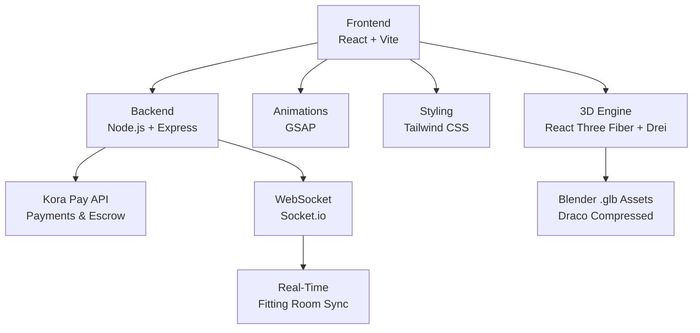
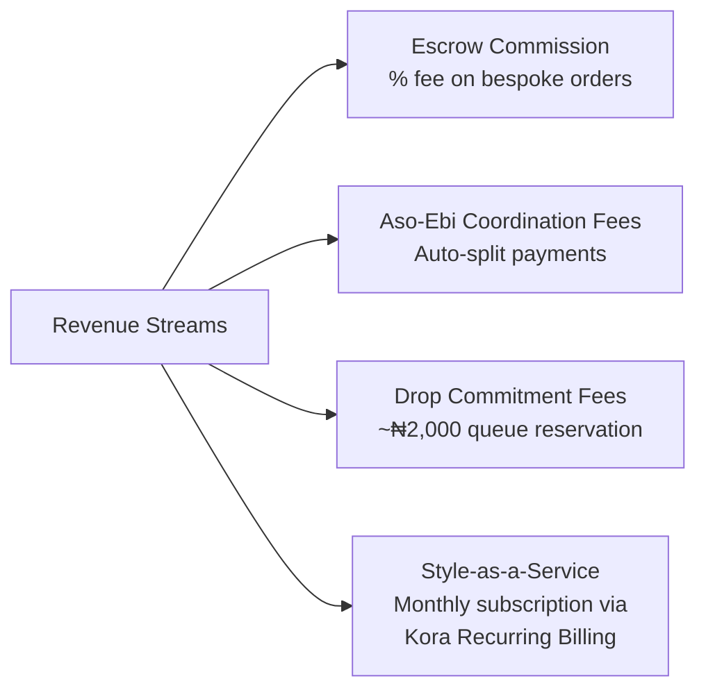
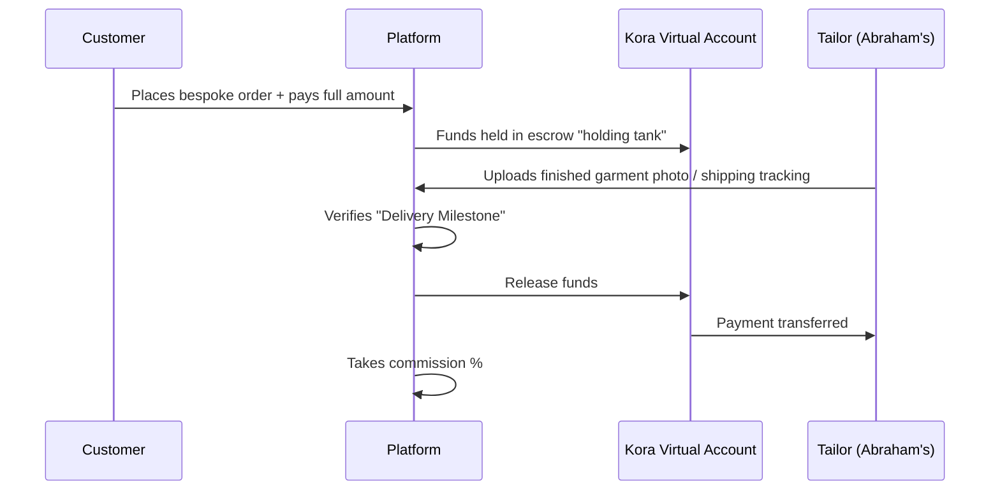
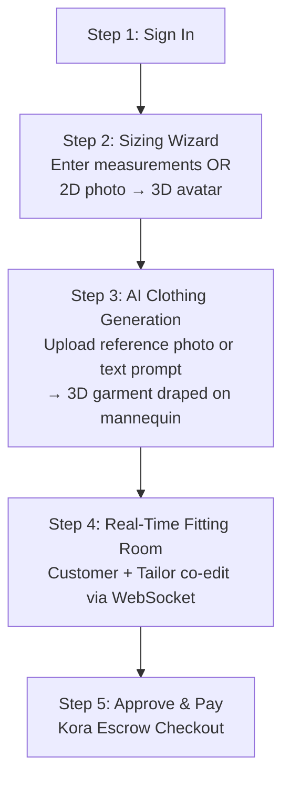

# 🧵 The Virtual Atelier — Project Analysis

> [!NOTE]
> This analysis is synthesized from **7 Word documents** found in `C:\Users\USER\Downloads\tutorials\virtual atelier`. Every major idea, feature, and technical decision from your planning documents is captured below.

---

## 📂 Documents Scanned

| # | Document | Focus Area |
|---|----------|------------|
| 1 | Blueprint for Building The Fabric Vault via Antigravity.docx | Step-by-step hackathon build plan |
| 2 | Blueprint for The Fabric Vault 3D Showroom.docx | System prompt & architecture for the 3D showroom |
| 3 | The Abraham's Collection Design System and Implementation Strategy.docx | UI/UX design system & branding for flagship brand |
| 4 | The Bespoke Escrow and AI Tailoring Pipeline.docx | AI sizing, real-time tailor collaboration & escrow |
| 5 | The Fabric Vault_ Phased Development System Prompt.docx | Phased execution plan with 4 modules |
| 6 | The Fabric Vault_ Secure Escrow and Aso-Ebi Logistics.docx | Escrow model & Aso-Ebi group payments |
| 7 | The Virtual Atelier_ A 3D Fashion E-commerce Strategy.docx | Full business plan, pricing, legal & onboarding |

---

## 🎯 The Big Idea

**The Virtual Atelier** (originally "The Fabric Vault") is a **minimalist 3D fashion e-commerce platform** designed for the **Kora Hackathon**. It replaces static product photos with **interactive 3D garments** that customers can rotate, zoom into, and inspect — like walking through a premium fashion gallery.

### Core Value Propositions
- **3D Digital Showroom** — Museum-style "Zen" aesthetic with interactive 3D garment models exported from Blender
- **Bespoke Escrow System** — Builds trust for international diaspora clients ordering custom garments from local tailors
- **AI-Powered Sizing & Tailoring** — Customers get a personalized 3D mannequin from their measurements; AI drapes clothing concepts onto it
- **Real-Time Tailor Collaboration** — WebSocket-synced 3D canvas where tailors and customers co-edit a garment in real-time
- **Aso-Ebi Group Payments** — Solves the logistics of coordinating group fabric orders for events (weddings, parties)
- **Cross-Border Payments via Kora** — Dynamic USD/NGN currency switching with "One-Click" checkout

### Flagship Brand
**Abraham's Collection** (your Dad's brand) serves as the proof-of-concept partner, with plans to scale to host other Nigerian/local fashion brands.

---

## 🏗️ Architecture & Tech Stack

| Layer | Technology | Purpose |
|-------|-----------|---------|
| Frontend | React + Vite | Fast SPA framework |
| 3D Engine | React Three Fiber (R3F) + Drei | WebGL 3D rendering of garments |
| Animation | GSAP | Smooth UI transitions, scroll effects, micro-interactions |
| Styling | Tailwind CSS | Minimalist UI overlays |
| Backend | Node.js + Express | API routing, payment processing |
| Payments | Kora Pay API | Checkout, escrow, split payments, recurring billing |
| Real-Time | Socket.io (WebSockets) | Live tailor-customer 3D canvas syncing |
| 3D Assets | Blender → .glb/.gltf | Garment models with Draco compression |
| AI/Sizing | Monocular camera / Polycam | Digital twin generation from 2D photos |

---

## 📋 Phased Development Plan

Your documents define a strict **3-phase, 7-module** build order:

### Phase 1 — Foundation (Build First)

#### Module 1: 3D Environment
- [x] Initialize a clean infinite-grid scene with "museum-style" lighting (soft ambient + sharp directional spotlights)
- [x] `.glb`/`.gltf` loader with `Suspense` and Draco compression
- [x] `Stage` component for rotate/zoom interaction on central garment
- [x] Raycaster hotspot system — click on chest, sleeve, etc. to trigger "Item Details" overlay

#### Module 2: Kora Pay Integration
- [ ] Backend endpoint `/api/initialize-payment` calling Kora's initialize API
- [ ] Dynamic pricing function (USD ↔ NGN currency toggle)
- [ ] Webhook listener for payment confirmation → "Thank You" modal/animation

### Phase 2 — Core UI/UX

#### Module 3: UI & UX
- [ ] No traditional navbars — "Ghost Buttons" + thin typography (Lato/Poppins)
- [ ] Clean slide-in drawer for Kora Checkout iframe on "Purchase" click
- [ ] Fully responsive 3D canvas (mobile + desktop)

#### Module 4: Abraham's Collection Design System
- [ ] iOS 26 glassmorphism (backdrop-blur, floating components) for modals/overlays
- [ ] Qoves UI clinical cleanliness (strict grids, massive negative space, ultra-thin typography)
- [ ] Gemini UI iconography (glowing, interactive hotspot icons with GSAP micro-interactions)
- [ ] Pinterest simplicity (no borders, no drop shadows, no navbars — 3D canvas is hero)
- [ ] Frosted-glass Kora Checkout drawer
- [ ] Pill-shaped USD/NGN currency toggle

### Phase 3 — Advanced Features (Build Last)

#### Module 5: Sizing & AI Handoff Flow
- [ ] Glassmorphism measurement onboarding wizard (max 3 steps) — tape measurements, weight, height
- [ ] Function to dynamically scale the base 3D mannequin from measurements
- [ ] Drag-and-drop reference photo/text upload
- [ ] Mock API endpoint `/api/generate-3d-concept` → returns a `.glb` garment layered on the user's mannequin

#### Module 6: Real-Time Tailor Collaboration
- [ ] Socket.io WebSocket setup for real-time "Fitting Room" sessions
- [ ] Live R3F canvas sync — tailor edits (scaling sleeves, changing fabric color) update instantly on customer's screen
- [ ] Minimalist chat sidebar in the Fitting Room

#### Module 7: Escrow Handoff + Advanced Media
- [ ] "Approve & Pay" button in Fitting Room → packages final 3D specs → triggers Kora Escrow checkout
- [ ] Dynamic video backgrounds with fade transitions
- [ ] Interactive 2D lookbook pictures reacting to scroll/mouse (GSAP)
- [ ] Cinematic camera panning, scroll-triggered 3D animations
- [ ] Post-processing effects (bloom, depth of field)

---

## 💰 Business Model & Revenue Streams

| Stream | Mechanism | Kora Feature |
|--------|-----------|-------------|
| **Escrow Commission** | Platform takes a % once "Delivery Milestone" is verified | Virtual Accounts |
| **Aso-Ebi Coordination Fee** | Auto-routed from each guest's payment to the organizer | Split Payment API |
| **Drop Commitment Fee** | Small refundable fee (₦2,000) to reserve a spot in exclusive releases | Payment Links |
| **Subscriptions** | Monthly premium for quarterly signature items / early access | Recurring Billing |

---

## 🤝 The Bespoke Escrow Flow

---

## 👤 The Customer Journey (3–5 Clicks)

---

## 🎨 Design Philosophy

> **"The 3D canvas is the absolute focus."**

- **iOS 26 Glassmorphism** — Heavy backdrop-blur, floating UI, frosted-glass panels
- **Qoves UI** — Clinical cleanliness, strict grid, massive whitespace, ultra-thin typography
- **Gemini UI** — Glowing, interactive iconography with smooth GSAP micro-interactions
- **Pinterest** — Uncluttered, card-based, no borders or drop shadows
- **Typography** — Lato / Poppins / Inter — thin, highly legible
- **Buttons** — "Ghost Buttons" (transparent, borderless)
- **No traditional navbars**

---

## 🎯 Target Audience

| Segment | Need |
|---------|------|
| **International Diaspora** | Bespoke garments from home with trust & escrow protection |
| **Gen-Z / Hypebeasts** | Exclusive drops with "Drop Reservation" scarcity mechanics |
| **Event Organizers** | Aso-Ebi coordination without chasing 50+ guests for money |
| **Local Fashion Brands** | Global reach through a premium 3D storefront |

---

## 📋 Hackathon Requirements (Kora Hackathon)

| Requirement | Status |
|-------------|--------|
| Team of 2–4 registered members | Needed |
| Public GitHub repo(s) | Needed |
| Mandatory Kora API integration | Planned (Modules 2 & 7) |
| Working live deployed link | Deploy to Vercel/Netlify/Render |
| 5-page pitch deck (max) | Condense from 12-slide draft |
| AI disclosure (Antigravity usage) | Required — document which sections are AI-generated |
| Pre-existing work disclaimer | Document when official build phase began |
| **Deadline: June 5th** | ⚠️ ~8 days from now |

---

## ⚖️ Legal Policies Needed

- **Bespoke & Escrow Refund Policy** — Define "Delivery Milestones" and refund conditions
- **Terms of Service** — Rules for Aso-Ebi group payments and Drop Reservations
- **Privacy Policy** — Data collection disclosure (Kora financial data, location for currency switching)

> [!IMPORTANT]
> Your documents recommend verifying all legal documents with a professional before launching.

---

## 🔑 Key Decisions & Open Questions

> [!IMPORTANT]
> These are decisions surfaced across your documents that may need resolution:

1. **Project Name** — Are you going with "The Virtual Atelier", or one of the alternatives (Loom & Escrow, Aura Bespoke, Thread 3D, Aso-Ebi Hub)?
2. **Color Palette** — Your documents mention you haven't yet provided hex codes. Do you have them now?
3. **Figma/Stitch Designs** — Have you completed the UI designs in Stitch/Figma for export?
4. **Blender Models** — Are your `.glb` garment exports ready?
5. **Kora API Keys** — Do you have your Kora account and API keys set up?
6. **Team Formation** — Is your 2–4 person team finalized?
7. **Scope for Hackathon** — Given the June 5th deadline (~8 days), which modules do you want to prioritize? Phases 1–2 seem essential; Phase 3 (AI sizing, real-time collab, advanced media) may need to be post-hackathon.
8. **Would you like me to start building?** — I can scaffold the full project right now following your phased plan.
