# Implementation Plan: Comprehensive Master Portfolio Website for Abraham Toluwani

Build and deploy an institutional-grade, responsive, dark/light brutalist portfolio web application for **Abraham Toluwani** (Covenant University Final-Year CS, Systems Architect, Smart Contract Engineer, Game Developer, 3D Artist, and Trader), synthesizing every project, conversation log, architecture diagram, and research artifact across his body of work.

---

## User Review Required

> [!IMPORTANT]
> **Project Scope & Architecture Inclusions**:
> 1. **STELCERA Trading Terminal Integration**: Adds the flagship 18-desk institutional trading terminal, cross-DEX arbitrage scanner, Black-Scholes options Greeks lab, and phased roadmap developed in recent sessions (`c74b4a6b` & `ee94c182`) to the flagship project catalog.
> 2. **Interactive Restored Conversations & Knowledge Vault**: Adds an interactive "Knowledge Vault / Research Archives" drawer and filterable browser inside the portfolio so visitors and recruiters can explore real transcripts, architecture blueprints, SQL schemas, and engineering logs directly from the UI.
> 3. **Design Aesthetics**: Adheres strictly to the editorial brutalist design language: high-contrast dark void (`#09090b`), sharp hairline borders (`1px solid var(--border)`), typography pairing (`Space Grotesk` headings + `Plus Jakarta Sans` body + `JetBrains Mono` code/metadata), and strict "Spend boldness in ONE place" restraint.

---

## Proposed System Architecture & Updates

```mermaid
graph TD
    App[App.jsx - Root State & Modals] --> Navbar[Navbar.jsx - Section Spy & Theme Switcher]
    App --> Hero[Hero.jsx - Polymath Convergence & Matrix]
    App --> Polymath[PolymathSynthesis.jsx - Cross-Discipline Causality Matrix]
    App --> Projects[ProjectSection.jsx - Category Filter & Flagships]
    Projects --> ProjectCard[ProjectCard.jsx - Editorial Badges & Architecture Highlights]
    App --> TerminalPreview[TradingTerminalDesk.jsx - Interactive Live STELCERA & D-MEX Simulators]
    App --> Vault[KnowledgeVaultSection.jsx - Filterable Conversation Logs & Artifacts Explorer]
    App --> About[AboutSection.jsx - Covenant CS Ethos & Chronological Timeline]
    App --> Skills[SkillsSection.jsx - 4-Domain Taxonomy with Operational Depth]
    App --> Lab[LabSection.jsx - SMC Algorithms, OEES Scent, Deepfake Thesis]
    App --> Now[NowSection.jsx - Live Focus Tracker & Chancellor's Cup Athletics]
    App --> Contact[ContactSection.jsx - Direct Inbox & Interactive Message Form]
    App --> Modal[CaseStudyModal.jsx - 10-Step Deep Architectural Breakdown]
    App --> Footer[Footer.jsx - Colophon, Social Links & System Stats]
```

---

## Detailed Component Upgrades

### 1. Data Layer (`src/data/portfolioData.js`)
- Add **STELCERA Institutional Trading Terminal** as a flagship project with its full 18-desk breakdown, sub-pixel Canvas engine details, cross-DEX arbitrage matrix, and Gantt roadmap.
- Update **D-MEX Protocol** with detailed BSc thesis defense metrics, Yul assembly gas benchmarks (38% gas reduction), and AI Guardian mempool inspector.
- Update **CivOS** with the complete 5-tier compute hierarchy diagram and lazy LLM orchestration.
- Update **Virtual Atelier & Fabric Vault** with Kora Pay milestone escrow and 3D WebGL drape simulation.
- Include **ANTHO**, **REAVO App**, **OEES (Olfactory HCI)**, **Paint Infusion (UE5)**, **CodePlay Naija**, **Face Emotion AI**, and **Pointillism Fine Art (Spectrum Ori)**.
- Integrate the **Restored Conversations Knowledge Vault** catalog (42+ sessions categorized into Web3, Systems, Trading, AI Research, and Creative).

### 2. Live Interactive Simulators & Preview Desks (`src/components/TradingTerminalDesk.jsx`)
- Interactive mini-demonstration widget allowing visitors to toggle between:
  - **STELCERA Arbitrage Scanner**: Live simulated spread monitor across Uniswap V3, Curve, Binance, and Bybit.
  - **D-MEX Atomic Swap Simulator**: Real-time visualization of HTLC timelock generation, secret hash commitment, and refund logic.
  - **CivOS 5-Tier Memory Hierarchy Visualizer**: Real-time visualization of how user interactions hit C++ deterministic logic first and only trigger LLMs on observer proximity.

### 3. Knowledge Vault & Conversation Archives Explorer (`src/components/KnowledgeVaultSection.jsx`)
- Interactive searchable & filterable table of historical research sessions with direct Markdown view modal.
- Allows visitors to inspect the depth of thinking, prompt engineering, SQL schemas, and audits behind every system.

### 4. Case Study Modal Deep-Dive (`src/components/CaseStudyModal.jsx`)
- Enhanced full-screen editorial slide-over with:
  - System architecture diagrams (ASCII/SVG/Flow).
  - Code snippet highlights (Solidity HTLC, C++ Bouncer, Python Async Engine).
  - Production results & quantified impact metrics.
  - Links to GitHub repositories and live deployments.

### 5. Styling, Typography & Design Tokens (`src/index.css` & `index.html`)
- Confirm Google Fonts loading: `Space Grotesk`, `Plus Jakarta Sans`, `JetBrains Mono`.
- Fine-tune contrast ratios for dark and light modes.
- Implement subtle grain texture and micro-interactions without performance overhead.

---

## Verification Plan

### Automated Build & Lint Verification
- Run `npm run build` using Vite to ensure zero compilation or bundling errors.
- Verify asset bundle sizes and asset compression.

### Functional & UI Verification
- Verify responsive layout across Mobile (375px), Tablet (768px), and Desktop (1440px+).
- Verify dark mode / light mode toggle persistence and CSS variable switching.
- Verify category filters in `ProjectSection` and `KnowledgeVaultSection`.
- Verify keyboard accessibility (ESC to close modals, tab navigation).
- Verify all links (GitHub, LinkedIn, X, Email, and internal section anchors).
