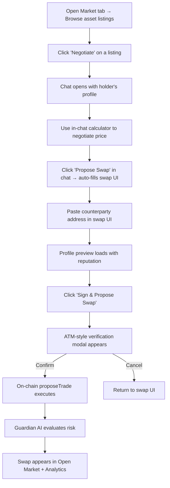

# Sprint 5 — Interactive Marketplace Swap System

Build a full peer-to-peer negotiated swap flow: discover assets → inspect holders → negotiate via chat → agree on terms → paste addresses → verify → execute swap.

## User Review Required

> [!IMPORTANT]
> This sprint adds **5 new UI components** to the existing frontend. All changes are additive — no existing swap logic is broken. The core `commitSwap` / `proposeTrade` flow is preserved; we add a **counterparty address field** and a **verification modal** before it fires.

> [!WARNING]
> The marketplace data uses **mock holders** (same approach as the existing `MOCK_TRADERS` array) since we don't have a backend indexer for real on-chain asset holders yet. The Guardian `/api/portfolio/:address` endpoint is used for real on-chain data when a valid address is pasted.

---

## Proposed Changes

### Component 1 — Asset Marketplace Tab

The existing "Open Market" tab gets upgraded from a simple order list to a full **Asset Marketplace** with:
- **Asset listing cards** showing asset type, estimated market value, holder profile avatar + address, and reputation score
- **Search/filter bar** to filter by asset type (ERC-20 / ERC-721 / ERC-1155)
- **"Negotiate" button** on each listing that opens the chat with that holder pre-filled

#### [MODIFY] [index.html](file:///c:/Users/USER/OneDrive/Documents/Desktop/FYP/D_MEX%20PROTOCOL/frontend/index.html)
- Replace the `#market-view` content with a two-column layout:
  - **Left**: Search bar + scrollable asset listing grid (cards with holder avatar, asset name, market value, holder reputation, "Negotiate" CTA)
  - **Right**: Selected asset detail panel (larger preview, holder track record stats, "Start Swap" button that pre-fills the swap UI)

---

### Component 2 — Enhanced Negotiation Chat with Calculator

Upgrade the existing `#chat-widget` with:
- **In-chat calculator toolbar** — a collapsible row above the input with `+`, `-`, `×`, `÷` buttons and a result display, so users can compute pricing mid-negotiation
- **"Propose Swap" quick-action button** in chat that sends a structured message like `📦 SWAP PROPOSAL: 100 DGLD ↔ 1 NFT Sword` and auto-fills the swap UI
- **Profile header** in chat showing the counterparty's avatar (gradient circle with initials from address), their address (copyable), and reputation badge

#### [MODIFY] [index.html](file:///c:/Users/USER/OneDrive/Documents/Desktop/FYP/D_MEX%20PROTOCOL/frontend/index.html)
- Expand `#chat-widget` with calculator row and propose-swap action bar
- Add profile picture (gradient avatar derived from address) in chat header

#### [MODIFY] [app.js](file:///c:/Users/USER/OneDrive/Documents/Desktop/FYP/D_MEX%20PROTOCOL/frontend/app.js)
- Add `calcOpen` toggle state and calculator arithmetic logic
- Add `proposeChatSwap()` function that sends a structured swap proposal message and pre-fills the create-intent tab

---

### Component 3 — Counterparty-Addressed Swap UI

The "Propose Intent" (`#create-view`) gets a new **counterparty address bar** at the top:
- **Paste-able address input** with a 📋 paste button
- Once a valid address is pasted, it fetches `/api/portfolio/:address` and shows:
  - Profile avatar (gradient circle with address-derived color)
  - Short address display
  - Reputation score badge
  - "Verified ✓" or "New User" tag
- This address becomes the `counterparty` parameter in `proposeTrade()` (currently hardcoded to `userAddr`)

#### [MODIFY] [index.html](file:///c:/Users/USER/OneDrive/Documents/Desktop/FYP/D_MEX%20PROTOCOL/frontend/index.html)
- Add `#counterparty-bar` section at the top of `#create-view`, before the swap interface
- Contains: input field, paste button, profile preview area

#### [MODIFY] [app.js](file:///c:/Users/USER/OneDrive/Documents/Desktop/FYP/D_MEX%20PROTOCOL/frontend/app.js)
- Add `resolveCounterparty(address)` function that calls `/api/portfolio/:address` and populates the profile preview
- Update `executeSwapCommit()` to use the pasted counterparty address instead of `userAddr`

---

### Component 4 — ATM-Style Swap Verification Modal

Before `proposeTrade()` fires on-chain, show a **full-screen verification modal** (like a bank transfer confirmation):
- Shows both sides: "You Send" and "They Receive" with asset icons and amounts
- Shows counterparty address + profile picture
- Shows estimated market values
- Shows D-MEX protocol terms reminder
- **"Confirm & Execute"** green button and **"Cancel"** outlined button
- Only after user confirms does the blockchain transaction proceed

#### [MODIFY] [index.html](file:///c:/Users/USER/OneDrive/Documents/Desktop/FYP/D_MEX%20PROTOCOL/frontend/index.html)
- Add `#swap-verify-modal` overlay with the verification layout

#### [MODIFY] [app.js](file:///c:/Users/USER/OneDrive/Documents/Desktop/FYP/D_MEX%20PROTOCOL/frontend/app.js)
- Add `showSwapVerification()` that populates and shows the modal
- Move `executeSwapCommit()` to only fire on modal confirm

---

### Component 5 — Guardian API: Marketplace Data Endpoint

#### [MODIFY] [guardian.js](file:///c:/Users/USER/OneDrive/Documents/Desktop/FYP/D_MEX%20PROTOCOL/guardian/guardian.js)
- Add `GET /api/marketplace` endpoint that returns mock asset listings with holder addresses, asset types, market values, and reputation scores
- Enhance the WebSocket chat relay to include room-based routing (sender→receiver pair)

---

### Styling

#### [MODIFY] [styles.css](file:///c:/Users/USER/OneDrive/Documents/Desktop/FYP/D_MEX%20PROTOCOL/frontend/styles.css)
- Marketplace grid and asset listing card styles
- Counterparty address bar with glassmorphic input
- Chat calculator toolbar styles
- Swap verification modal (full-screen glass overlay with card layout)
- Gradient avatar generator (CSS-only, based on `:nth-child` or inline style from JS)

---

## File Change Summary

| File | Changes |
|------|---------|
| [index.html](file:///c:/Users/USER/OneDrive/Documents/Desktop/FYP/D_MEX%20PROTOCOL/frontend/index.html) | Marketplace UI, counterparty bar, chat upgrades, verification modal |
| [styles.css](file:///c:/Users/USER/OneDrive/Documents/Desktop/FYP/D_MEX%20PROTOCOL/frontend/styles.css) | ~200 lines of new CSS for marketplace, calculator, verification modal |
| [app.js](file:///c:/Users/USER/OneDrive/Documents/Desktop/FYP/D_MEX%20PROTOCOL/frontend/app.js) | Marketplace loader, counterparty resolver, calculator logic, verification flow |
| [guardian.js](file:///c:/Users/USER/OneDrive/Documents/Desktop/FYP/D_MEX%20PROTOCOL/guardian/guardian.js) | `/api/marketplace` endpoint, enhanced chat routing |

---

## User Flow (End-to-End)

---

## Verification Plan

### Automated Tests
- Start Guardian server: `cd guardian && node guardian.js`
- Open `http://localhost:3000` in browser
- Test marketplace tab loads asset listings
- Test chat opens with calculator functional
- Test pasting a valid address shows profile preview
- Test verification modal appears before swap commits

### Manual Verification
- Connect wallet → Open Market tab → browse listings
- Click Negotiate → chat opens → use calculator → propose swap
- Paste counterparty address → see profile load
- Click propose → verification modal appears → confirm → on-chain tx fires
