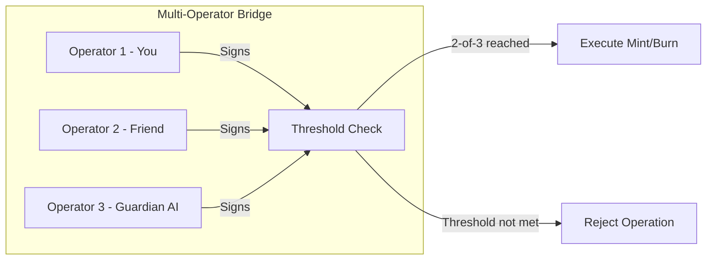
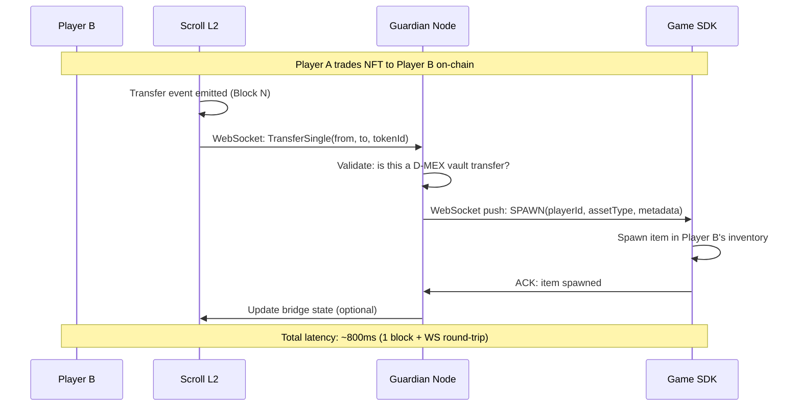

# D-MEX MVP Finalization Plan

## Answers to Your Questions First

### "Valve has a free API like Steam?"
**Valve IS Steam.** Valve Corporation owns and operates Steam. The Steam Web API is **completely free**:
- Get your key at: https://steamcommunity.com/dev/apikey
- Endpoints you'd use:
  - `IEconService/GetTradeOffers` — detect incoming/outgoing trades
  - `ISteamUser/GetPlayerSummaries` — player identity
  - `IEconItems_730/GetPlayerItems` — CS2 inventory (appID 730)
- Rate limit: ~100,000 calls/day (more than enough for MVP)
- **No commercial license needed** for read-only operations

### "Will it still be a protocol if the bot is centralized?"
Yes — **if the smart contract enforces the rules, not the bot**. The bot is just a *messenger* between Steam and the blockchain. The `UniversalVault` contract is the authority. Think of it like:
- **PayPal** = centralized (PayPal decides everything)
- **D-MEX** = protocol with a centralized *relay* (the contract decides, the bot just carries messages)

For your FYP, this framing is academically honest and technically correct.

---

## Workstream 1: Live On-Chain Testing (You + Friend)

> [!IMPORTANT]
> This is the highest priority. A live 2-person demo would massively strengthen your FYP.

### Prerequisites (Both Users)

| Step | You | Your Friend |
|------|-----|-------------|
| 1. Install MetaMask | ✅ Already done | Needs to install |
| 2. Add Scroll Sepolia network | Chain ID: 534351, RPC: `https://sepolia-rpc.scroll.io` | Same |
| 3. Get Sepolia ETH | Faucet: `sepoliafaucet.com` or `sepolia-faucet.pk910.de` | Same |
| 4. Bridge to Scroll Sepolia | https://scroll.io/bridge (bridge 0.05 ETH) | Same |
| 5. Get D-MEX tokens | Via Guardian faucet endpoint (we'll build this) | Same |

### What We Need to Build: Guardian Faucet Endpoint

Currently there's no way for a new user to get DGLD/NFT tokens without the deployer key. We need a `/api/faucet` endpoint:

#### [NEW] Guardian Faucet API (`guardian/guardian.js`)
```
POST /api/faucet
Body: { address: "0x..." }
Response: { dgld: "1000", swordId: 3, commodityAmount: "50" }
```

**What it does:**
1. Uses the Guardian wallet (which has minting rights) to call:
   - `GameCurrency.mint(userAddr, 1000e18)` — gives 1000 DGLD
   - `GameAssetUnique.mint(userAddr)` — mints 1 NFT Sword
   - `GameCommodity.mint(userAddr, 0, 50)` — gives 50 Commodities
2. Rate-limited: 1 faucet claim per address per hour
3. Requires the Guardian wallet to have Scroll Sepolia ETH for gas

### Live Test Script (All 3 Swap Methods)

#### Method 1: Counterparty Address Swap
```
1. You: Connect MetaMask → click "Propose Intent" tab
2. You: Paste friend's address in counterparty field
3. You: Set "You Offer" = 100 DGLD, "You Receive" = 1 NFT Sword
4. You: Click "Sign & Propose Swap"
5. Guardian evaluates → approves → tx submitted to Scroll
6. Friend: Can see the swap in "Open Market" tab
7. Both: Verify balances changed on-chain
```

#### Method 2: Open Market Swap
```
1. Friend: Lists their Loot Bag on the marketplace
2. You: Browse marketplace → find their listing
3. You: Click "Start Swap" → auto-fills offer/receive
4. You: Adjust amounts → propose
5. Guardian evaluates and signs
```

#### Method 3: Peer Discovery + Negotiate
```
1. You: Go to "Peer Discovery" tab
2. You: Find friend's address in the trader grid
3. You: Click "Negotiate" → chat widget opens
4. You: Discuss terms → click "Propose Swap in Chat"
5. Both: Confirm and execute
```

> [!WARNING]
> **Blockers for live testing:**
> - RPC endpoints must be working (Scroll Sepolia public RPCs are often down)
> - Guardian wallet needs Scroll Sepolia ETH for gas (to mint tokens via faucet)
> - Both users need to approve token spending to the Vault contract

---

## Workstream 2: Solving Centralized Bot Risk

### The Problem
A single bot holding game items is a single point of failure. If the bot is compromised, all custodied items are at risk.

### Solution: Multi-Operator Validation (Feasible for FYP)

Instead of 1 bot deciding everything, require **2-of-3 operators to agree** before any bridge operation:



**For FYP scope**, implement this as:
1. The Guardian AI auto-signs if risk score < 30 (low risk)
2. For high-risk operations, require a manual confirmation from a second operator
3. The smart contract enforces the multi-sig check on-chain

**The pitch framing:**
> *"D-MEX uses a threshold validation model. No single operator can mint or burn assets unilaterally. The Guardian AI acts as an automated co-signer, but high-value operations require human confirmation — making the system resistant to single-point-of-failure attacks."*

### Full Decentralization (Post-FYP Vision)

For truly trustless operation, there are 3 emerging approaches:

#### A. EigenLayer AVS (Actively Validated Services)
- Operators **stake ETH** to participate in the bridge network
- If they act maliciously (mint fake NFTs, refuse to release items), their stake is **slashed**
- This creates economic security — cheating costs more than it gains
- **Reality check**: EigenLayer AVS is production-ready on mainnet but complex to integrate

#### B. ZK Coprocessors (Zero-Knowledge Game State Proofs)
- The game generates a **zero-knowledge proof** that Player X owns Item Y
- This proof is verified on-chain — no trusted operator needed
- The contract mints only if the ZK proof is valid
- **Reality check**: This requires the game to generate ZK proofs, which no major game engine supports natively yet. However, for **on-chain games** (like Dark Forest, Loot), this is already possible.

#### C. Optimistic Bridges with Fraud Proofs
- Anyone can challenge a bridge operation within a dispute window (e.g., 7 days)
- If challenged and proven fraudulent, the operation is rolled back and the operator is penalized
- **Reality check**: This is how Optimism and Arbitrum work. Practical but introduces delay.

> [!TIP]
> **For your FYP**: Mention all three in your report as "future work" but implement the multi-operator threshold approach. This is academically rigorous and practically demonstrable.

---

## Workstream 3: Double-Spend Prevention (Atomic Burn → Respawn)

### The Tight-Scale Solution



### How Sub-Second Works

1. **On-chain event** fires the moment the transfer tx is included in a block (~0.5s on Scroll L2)
2. **Guardian WebSocket listener** catches the event in real-time (no polling — uses `provider.on('Transfer', ...)`)
3. **Guardian pushes** spawn instruction to the game SDK via WebSocket (~50ms)
4. **Game SDK spawns** the item immediately (~200ms)

### Implementation in the Guardian

```javascript
// Listen for ALL transfers on D-MEX token contracts
const tokenContracts = [DGLD, NFT_SWORD, COMMODITY];
tokenContracts.forEach(contract => {
    contract.on('Transfer', async (from, to, tokenIdOrAmount, event) => {
        // Only process D-MEX vault transfers
        if (from === VAULT_PROXY || to === VAULT_PROXY) {
            const spawnInstruction = {
                type: 'asset_spawn',
                recipient: to,
                asset: resolveAssetType(contract.target),
                amount: tokenIdOrAmount.toString(),
                txHash: event.transactionHash,
                timestamp: Date.now()
            };
            // Push to all connected game SDKs
            broadcastWS(spawnInstruction);
        }
    });
});
```

### Double-Spend Prevention Rules

| Rule | Enforcement |
|------|------------|
| NFT can only be traded if it exists | ERC-721 `ownerOf()` check — on-chain, trustless |
| Burn destroys the NFT permanently | `_burn()` in smart contract — irreversible |
| Game item only spawns on confirmed transfer | Guardian waits for block confirmation before pushing |
| Same NFT can't trigger two spawns | Guardian tracks `txHash` → deduplicates events |

---

## Workstream 4: Steam API Integration (Real, Not Simulated)

### What Changes from Simulation → Real

| Component | Current (Simulation) | Real Steam API |
|-----------|---------------------|----------------|
| Inventory fetch | Mock JSON data | `GET /IEconItems_730/GetPlayerItems/v0001/?key=KEY&steamid=ID` |
| Item verification | Hardcoded skins | Verify `classid` + `instanceid` from Steam |
| Trade detection | Button click | Poll `IEconService/GetTradeOffers` every 30s |
| Item custody | localStorage | Steam bot account accepts trade offer |

### Work Required

1. **Steam Bot Account**: Create a separate Steam account that acts as the escrow bot
2. **Steam Guard**: Enable 2FA on the bot account (required for trading)
3. **`node-steam-tradeoffer-manager`**: npm package that handles trade offers programmatically
4. **Guardian endpoint**: `POST /api/bridge/steam/deposit` triggers inventory check
5. **Mint trigger**: On confirmed trade receipt, call `GameAssetUnique.mint(playerAddr)`

> [!CAUTION]
> **For FYP**: The simulation you have is sufficient. Real Steam integration requires a 15-day Steam Guard waiting period for a new bot account. Only pursue this if you have 2+ weeks before your viva.

---

## Workstream 5: Remaining Frontend Fixes

Based on our current session and the codebase state:

| Issue | Status | Priority |
|-------|--------|----------|
| Dropdown follows scroll | ✅ Fixed | — |
| WebSocket disconnect spam | ✅ Fixed | — |
| Marketplace → swap auto-fill | ✅ Fixed | — |
| Listing detail modal | ⚠️ Needs testing | Medium |
| RPC failover in frontend | ⚠️ Intermittent | Medium |
| Demo mode token seeder | ❌ Not built | High (needed for live test) |
| Faucet endpoint for real users | ❌ Not built | **Critical** (needed for live test) |

---

## Work Estimate

| Workstream | Effort | Priority |
|-----------|--------|----------|
| **WS1: Live Testing Setup** (faucet endpoint + test script) | ~3-4 hours | 🔴 Critical |
| **WS2: Multi-Operator Threshold** (2-of-3 signing) | ~4-5 hours | 🟡 Medium |
| **WS3: Double-Spend / Atomic Respawn** (event listener + WS push) | ~3-4 hours | 🟡 Medium |
| **WS4: Real Steam API** (bot + trade offers) | ~8-12 hours + 15-day wait | 🟢 Optional |
| **WS5: Frontend Polish** (remaining bugs + UX) | ~2-3 hours | 🔴 Critical |
| **Documentation** (README, pitch slides, architecture diagrams) | ~2-3 hours | 🟡 Medium |

### Total: ~15-20 hours of coding for the core MVP (excluding Steam real API)

## Recommended Order

1. **Frontend fixes** (WS5) — get the UI solid first
2. **Faucet endpoint** (WS1) — enable real user testing
3. **Live test with friend** (WS1) — validate the full flow
4. **Double-spend prevention** (WS3) — strengthen the protocol story
5. **Multi-operator threshold** (WS2) — if time permits
6. **Steam API** (WS4) — only if 2+ weeks remain

## Open Questions

> [!IMPORTANT]
> 1. **When is your FYP viva?** This determines whether we can do Steam real API (needs 15 days for Steam Guard).
> 2. **Does your Guardian wallet have Scroll Sepolia ETH?** We need gas to mint tokens for the faucet.
> 3. **What other frontend issues are you seeing?** You mentioned "we have to sort out the frontend issues" — can you list them?
> 4. **Do you want to implement multi-operator threshold for the FYP, or just mention it as future work?**
