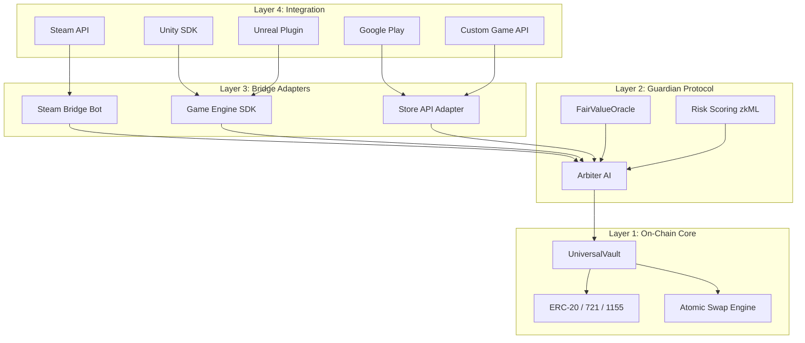

# D-MEX Game Integration — Architecture Analysis

## Your Proposal: What's Right ✅

Your detect-trigger loop is the correct foundational pattern. Specifically:

- **Polling + Webhook hybrid** — you correctly identified both, and in practice you'd use webhooks with polling fallback (not either/or)
- **Burn-to-unlock** — this is the standard bridge pattern (lock/mint ↔ burn/unlock)
- **Metadata mapping** — capturing game traits as on-chain metadata is essential for cross-game value translation

The core insight — that game assets live in walled gardens and need a neutral escrow layer to become interoperable — is exactly what D-MEX should solve.

---

## Critical Gaps in the Current Proposal ⚠️

### 1. The Custody Problem (Who Holds the Item?)

Your proposal says "the bot receives the item" — but this creates a **centralised custodian**. If your bot holds every deposited item, you've built a centralised exchange, not a protocol.

**The D-MEX answer should be:**
```
Game Item → Locked in Escrow (bot-controlled, but governed by smart contract rules)
                ↕
         NFT Minted on Scroll (represents claim on the escrowed item)
```

The bot is a **permissioned operator**, not an owner. The smart contract (your `UniversalVault`) is the authority. The bot can only release items when the contract says so (after burn verification). This is what makes it a *protocol* not a *service*.

### 2. The Oracle Trust Problem

> "Your bot detects this burn event and initiates a trade offer back"

Who verifies the bot is honest? What if the bot operator mints fake NFTs, or refuses to return items after burn?

**D-MEX's existing answer (from your architecture):**
- The **Arbiter Guardian** validates all operations
- The **zkML threat matrix** scores trust
- Multi-sig or threshold signatures could gate release operations

For your pitch, frame this as: *"D-MEX doesn't trust the bridge operator — the Guardian AI validates every cross-system operation before it's finalized."*

### 3. The Double-Spend / State Sync Risk

What happens if:
- Player deposits a CS2 skin → gets an NFT
- Player then trades the NFT to someone on-chain
- Meanwhile, the original Steam item is still "locked" in the bot's inventory
- But what if the bot crashes, or someone socially engineers the bot to release the item?

**Now two people think they own the same skin.**

Your protocol needs a **state commitment**: the NFT's existence IS the proof of custody. If the NFT exists, the item MUST be locked. If the NFT is burned, the item MUST be released. No manual intervention.

### 4. Cross-Game Value Translation

Your proposal covers minting but not **value equivalence**. When someone trades a CS2 AWP Dragon Lore for a Loot Bag, how does D-MEX ensure fairness?

**This is where your FairValueOracle already shines** — you've built this. The pitch should emphasize that D-MEX doesn't just bridge assets, it **prices them fairly using AI-driven risk scoring**.

---

## The Three Integration Paths — Ranked

### Path A: Game Store APIs (Steam, Epic, Google Play)

| Aspect | Assessment |
|--------|-----------|
| **Feasibility** | ⭐⭐⭐⭐⭐ Highest — APIs already exist |
| **Permission needed** | None for Steam (public API). Google Play requires dev account |
| **Reach** | Massive — Steam alone has 130M+ monthly active users |
| **Trust model** | Bot-as-custodian (centralized risk) |
| **Best for** | FYP demo, MVP, proof of concept |

**How it works with D-MEX:**
```
Player → Steam Trade Offer → D-MEX Bridge Bot → Verifies Receipt
    → Mints NFT on Scroll via UniversalVault
    → NFT appears in D-MEX Marketplace
    → Cross-game swap happens on-chain
    → Burn NFT → Bot sends Steam trade offer back
```

> [!TIP]
> **This is what you've already simulated** with your CS2 Steam Bridge modal. For your FYP, this is the strongest path because you can demo it end-to-end.

---

### Path B: Game Engine Plugins / SDKs (Unreal, Unity)

| Aspect | Assessment |
|--------|-----------|
| **Feasibility** | ⭐⭐⭐ Medium — requires game developers to integrate |
| **Permission needed** | Game developer must install the SDK |
| **Reach** | Selective — only games that opt in |
| **Trust model** | Semi-decentralized — game validates ownership natively |
| **Best for** | New games, indie developers, Web3-native games |

**How it works with D-MEX:**
```
Game (with D-MEX SDK) → Player earns "Dragon Sword"
    → SDK calls D-MEX API: "Mint this asset for player 0x..."
    → UniversalVault mints the NFT
    → Asset is now tradeable across ALL D-MEX-enabled games
    → When traded, the receiving game's SDK detects the transfer
    → SDK spawns the equivalent item in-game
```

**The SDK would provide:**
```
// Unity C# Example (conceptual)
DMEXBridge.RegisterAsset("dragon_sword", AssetType.ERC721, metadata);
DMEXBridge.OnAssetReceived += (asset) => {
    SpawnItem(asset.gameId, asset.metadata);
};
DMEXBridge.DepositToVault(playerItem, playerWalletAddress);
```

> [!IMPORTANT]
> This is the **strongest long-term vision** but hardest to demo for FYP because you'd need a game developer partner. However, you can **simulate** this with a mock Unreal/Unity scene that shows the SDK flow.

---

### Path C: Direct Game Company Integration

| Aspect | Assessment |
|--------|-----------|
| **Feasibility** | ⭐ Lowest — requires business partnerships |
| **Permission needed** | Full commercial agreement |
| **Reach** | Depends on partner |
| **Trust model** | Best — game validates natively, no custody needed |
| **Best for** | Mainnet production, post-graduation |

**How it works:**
The game company runs a D-MEX node. Their game server directly interacts with the UniversalVault contract. No bridge bot needed — the game IS the bridge.

> [!NOTE]
> This is the endgame vision, not the FYP deliverable. But **mention it in your pitch** as the roadmap.

---

## Recommended Architecture: The 4-Layer Model

Rather than thinking in terms of "Steam bridge" or "Unity SDK", present D-MEX as a **layered protocol**:



**Why this is better than your current framing:**
- Each game platform gets its own **adapter** (Layer 3), but they all speak the same **protocol** (Layer 2)
- The Guardian validates ALL operations regardless of which adapter triggered them
- Adding a new game = writing a new adapter, not modifying the protocol
- This is what makes D-MEX a **protocol** not just a Steam bot

---

## FYP Pitch Framing

### The Problem (30 seconds)
> *"$200 billion worth of in-game assets are locked in walled gardens. A CS2 skin worth $1,000 cannot be traded for a Loot NFT worth $1,000 — because they exist in different ecosystems with no interoperability layer."*

### The Solution (30 seconds)
> *"D-MEX is a decentralized protocol that bridges game assets across ecosystems using AI-secured atomic swaps. Any game asset — from Steam skins to on-chain NFTs to UGC 3D models — can be safely bartered through a universal escrow vault on Scroll L2."*

### What Makes It Different (30 seconds)
> *"Three things:*
> 1. *The Arbiter Guardian AI evaluates every swap for fraud, value manipulation, and psychological exploitation before it's finalized.*
> 2. *The FairValueOracle provides real-time cross-game price discovery — so a Dragon Lore is never accidentally traded for a common item.*
> 3. *The architecture is adapter-based — integrating a new game requires only writing a bridge adapter, not modifying the core protocol."*

### Demo Flow (what you show)
1. **Steam Bridge**: Sync CS2 inventory → skins appear in D-MEX marketplace
2. **Cross-Game Swap**: Trade a CS2 skin for a Loot Bag — two different ecosystems, one atomic transaction
3. **Guardian Intervention**: Show the AI catching a bad trade (wash trading, value drain)
4. **UGC Mint**: Upload a 3D model from Unreal → mint as tradeable NFT

---

## My Honest Assessment

| Approach | For FYP? | For Production? |
|----------|----------|----------------|
| Steam API Bridge (Path A) | ✅ **Best choice** — you've already built the simulation | ✅ Viable MVP |
| Game Engine SDK (Path B) | ⚠️ Good to mention, hard to demo without a real game | ✅ Strong long-term |
| Direct Integration (Path C) | ❌ Needs business deals, not feasible for FYP | ✅ The endgame |
| Your current simulation approach | ✅ **Perfect for FYP** — shows the concept without needing Valve's cooperation | ⚠️ Needs real APIs for production |

### Bottom Line

Your proposal is **good and directionally correct**. The polling/webhook + mint/burn loop is the right foundation. What elevates it from "a Steam trading bot" to "a protocol" is:

1. **The layered architecture** (not just Steam — any game through adapters)
2. **The Guardian AI** (not just bridging — intelligent risk management)
3. **The FairValueOracle** (not just swapping — fair cross-game pricing)
4. **The atomic swap engine** (not just trading — trustless escrow)

You've already built pieces 2, 3, and 4. The bridge logic (piece 1) is what ties it all together. For your FYP, the simulation approach you have is perfect — just frame it as "this is how it works with Steam, and the same adapter pattern extends to any game ecosystem."
