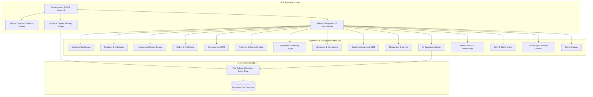

# Implementation Plan: REAVO Corporate Admin OS Full Production Upgrade

Upgrade the REAVO Admin Panel into a complete, enterprise-grade **Corporate Admin Operating System + AI Operations Assistant** directly based on [`reavo_admin_os_full_spec.md`](file:///c:/Users/USER/Downloads/trading/reavo_admin_os_full_spec.md).

---

## 🏛️ Architecture & System Scope

The Corporate Admin OS serves as the internal operating system for REAVO staff to manage products, inventory, orders, customer CRM, trade-in valuations, payment reconciliations, marketing campaigns, content CMS, business intelligence analytics, and audit security without touching code.



---

## Proposed Changes

### 1. Admin Layout & Shell Navigation
#### [MODIFY] [`AdminLayout.jsx`](file:///c:/Users/USER/Downloads/trading/reavo-app/src/components/admin/AdminLayout.jsx)
- Expand sidebar navigation to include all 15 operational modules with dedicated badges for pending alerts.
- Modernize top-bar with live store health indicators, quick search trigger, and notifications drawer.
#### [MODIFY] [`AdminCommandPalette.jsx`](file:///c:/Users/USER/Downloads/trading/reavo-app/src/components/admin/AdminCommandPalette.jsx)
- Add quick jump commands for all 15 modules, instant AI prompts, and shortcut actions (`Add Product`, `Export Orders`, `Check Low Stock`).

---

### 2. Core Operational Modules (Pages)
#### [NEW] [`AdminInventory.jsx`](file:///c:/Users/USER/Downloads/trading/reavo-app/src/pages/admin/AdminInventory.jsx)
- Real-time stock level tracker, low-stock threshold alerts, restock velocity ranking, and 1-click bulk stock modifier with preview & approval modal.
#### [NEW] [`AdminCustomers.jsx`](file:///c:/Users/USER/Downloads/trading/reavo-app/src/pages/admin/AdminCustomers.jsx)
- Comprehensive customer profiles, lifetime value (LTV) metrics, order histories, abandoned checkout detector, and customer communication drafts.
#### [NEW] [`AdminTradeIns.jsx`](file:///c:/Users/USER/Downloads/trading/reavo-app/src/pages/admin/AdminTradeIns.jsx)
- Trade-in valuation pipeline: device submission details, condition grading, quote appraisal status, payout approvals, and customer notifications.
#### [NEW] [`AdminPayments.jsx`](file:///c:/Users/USER/Downloads/trading/reavo-app/src/pages/admin/AdminPayments.jsx)
- Transaction ledger, payment gateway status reconciliation (Kora, Paystack, Bank Transfers), webhook error monitoring, and refund records.
#### [NEW] [`AdminDiscounts.jsx`](file:///c:/Users/USER/Downloads/trading/reavo-app/src/pages/admin/AdminDiscounts.jsx)
- Promotional code generator (percentage, fixed amount, free delivery), minimum spend threshold rules, validity date picker, and usage analytics.
#### [NEW] [`AdminContent.jsx`](file:///c:/Users/USER/Downloads/trading/reavo-app/src/pages/admin/AdminContent.jsx)
- Storefront CMS: Hero banner configurator, announcement bar ticker, Lookbook gallery management, and FAQ content editor.
#### [NEW] [`AdminAnalytics.jsx`](file:///c:/Users/USER/Downloads/trading/reavo-app/src/pages/admin/AdminAnalytics.jsx)
- Business intelligence dashboard: Revenue trends, conversion rate funnel, category performance matrix, AOV benchmarks, and AI-assisted sales attribution.
#### [NEW] [`AdminStaff.jsx`](file:///c:/Users/USER/Downloads/trading/reavo-app/src/pages/admin/AdminStaff.jsx)
- Team directory, Role-Based Access Control (RBAC) assignments (`Superadmin`, `Store Manager`, `Support Specialist`, `Auditor`), and permissions manager.
#### [NEW] [`AdminAuditLogs.jsx`](file:///c:/Users/USER/Downloads/trading/reavo-app/src/pages/admin/AdminAuditLogs.jsx)
- Immutable audit stream: tracks every record mutation, staff actor, timestamp, affected entity, and rollback information.
#### [NEW] [`AdminSettings.jsx`](file:///c:/Users/USER/Downloads/trading/reavo-app/src/pages/admin/AdminSettings.jsx)
- Store controls: Maintenance mode toggle, currency exchange rate configuration, shipping rate zones, AI copilot tuning, and webhook endpoints.

---

### 3. Upgrades to Existing Modules
#### [MODIFY] [`AdminDashboard.jsx`](file:///c:/Users/USER/Downloads/trading/reavo-app/src/pages/admin/AdminDashboard.jsx)
- Add actionable Operational Alerts banner (`Low Stock Urgency`, `Unfulfilled Orders`, `Pending Trade-Ins`, `Payment Verifications Needed`).
- Add executive KPI summary cards with comparison delta percentages and rapid navigation.
#### [MODIFY] [`AdminProducts.jsx`](file:///c:/Users/USER/Downloads/trading/reavo-app/src/pages/admin/AdminProducts.jsx)
- Integrate **AI Product Creator modal**: generates product titles, descriptions, SEO tags, and tech specs from raw text and images.
- Add Bulk CSV Import validator with error/warning preview before database commit.
#### [MODIFY] [`AdminOrders.jsx`](file:///c:/Users/USER/Downloads/trading/reavo-app/src/pages/admin/AdminOrders.jsx)
- Add multi-stage fulfillment workflow modal (`Pending` → `Processing` → `Dispatched` → `Delivered`).
- Add printable invoice/receipt viewer and Kora payment verification status tag.
#### [MODIFY] [`AdminAIOperations.jsx`](file:///c:/Users/USER/Downloads/trading/reavo-app/src/pages/admin/AdminAIOperations.jsx) & [`AdminAICopilotWidget.jsx`](file:///c:/Users/USER/Downloads/trading/reavo-app/src/components/admin/AdminAICopilotWidget.jsx)
- Equip AI Operations with complete tool registry (25+ tools) with dual-phase execution: **Analyze & Propose** → **User Confirmation** → **Execute Mutation**.
- Include 1-click operational routines: `Daily Executive Briefing`, `Restock Plan Generator`, `Price Adjustment Preview`.

---

### 4. Router & Spec Synchronization
#### [MODIFY] [`App.jsx`](file:///c:/Users/USER/Downloads/trading/reavo-app/src/App.jsx)
- Register all new admin sub-routes (`/admin/inventory`, `/admin/customers`, `/admin/trade-ins`, `/admin/payments`, `/admin/discounts`, `/admin/content`, `/admin/analytics`, `/admin/staff`, `/admin/audit-logs`, `/admin/settings`).
#### [MODIFY] [`reavo_admin_os_full_spec.md`](file:///c:/Users/USER/Downloads/trading/reavo_admin_os_full_spec.md)
- Update implementation roadmap status and add production verification instructions.

---

## Verification Plan

### Automated Verification
1. Run local lint and JSX build verification:
   ```powershell
   npm run build
   ```
2. Verify all routes render with zero console errors and zero broken imports.

### Manual Verification
1. **Navigation & Command Palette**: Test `Ctrl+K` / `Cmd+K` to search and jump to all 15 operational modules.
2. **AI Operations & Restock Flow**: Test natural language commands (e.g., `"Show products below 5 units"` and `"Generate today's sales report"`).
3. **Safety Gate**: Verify that bulk mutations require an interactive confirmation step before mutating data.
4. **Theme & Responsiveness**: Test dark glass aesthetic across mobile and desktop viewports.
