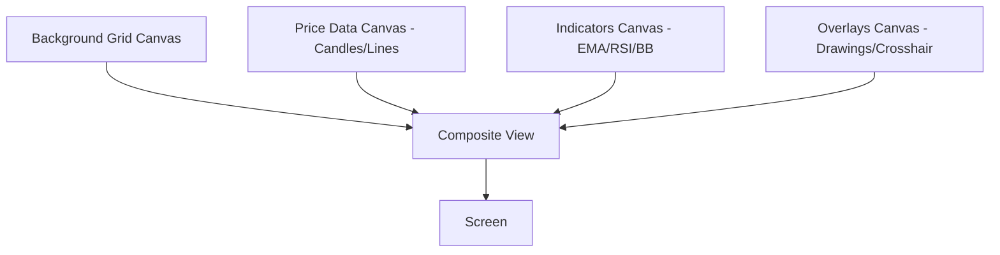
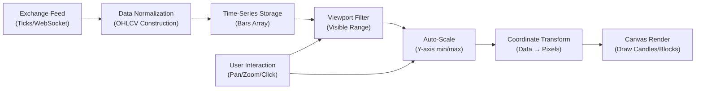
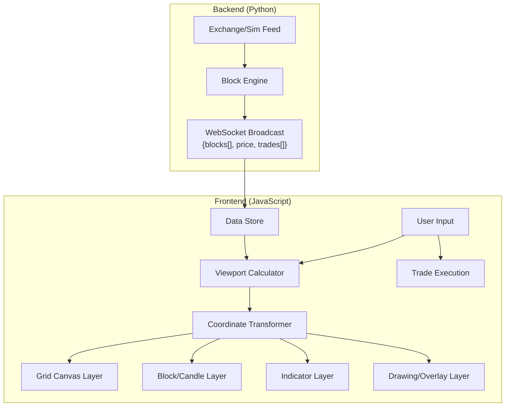

# How Professional Trading Terminal Charts Work
## TradingView, MT5, and Industry Architecture Research

---

## 1. The Core Concept: Coordinate Transformation

Every trading chart is fundamentally a **mapping engine** that converts `(Time, Price)` → `(X_pixel, Y_pixel)`.

```
┌─────────────────────────────────────────────────┐
│  DATA SPACE (abstract)     SCREEN SPACE (pixels) │
│                                                   │
│  (timestamp, price)  ──→  (x_pixel, y_pixel)     │
│                                                   │
│  Time  → X:  x = (timestamp - viewStart) * scale │
│  Price → Y:  y = (viewMaxPrice - price) * scale  │
│              (inverted: higher price = lower y)   │
└─────────────────────────────────────────────────┘
```

> [!IMPORTANT]
> **This is the fundamental difference from STELCERA's current approach.** Professional charts use `price` and `time` as the primary coordinate system, then transform to pixels. STELCERA uses `col` and `row` indices directly as pixel coordinates — which makes viewport alignment fragile.

---

## 2. TradingView Architecture

### Multi-Layer Canvas System
TradingView uses **separate canvas elements** for different chart layers:



**Why layers?** When a crosshair moves, only the overlay canvas redraws — the expensive candlestick layer stays cached. This is how they maintain **60fps** during interaction.

### Coordinate Spaces
TradingView defines two coordinate spaces:

| Space | Description | Used For |
|-------|-------------|----------|
| **Logical (Data)** | `{time, price}` pairs | Data storage, indicator calculation |
| **Media (Pixel)** | `{x, y}` pixel positions | Canvas drawing, mouse hit-testing |

They provide explicit conversion methods:
```javascript
// TradingView Lightweight Charts API
series.priceToCoordinate(price)  → y_pixel
series.coordinateToPrice(y_pixel) → price
timeScale.timeToCoordinate(time) → x_pixel
```

### Auto-Scaling (The Key Feature)
When you zoom or scroll, TradingView:
1. Determines which bars are **visible** in the current viewport
2. Finds the **min/max price** among only those visible bars
3. Adds **5-10% padding** to top and bottom
4. Sets the Y-axis range to `[min - padding, max + padding]`
5. Recomputes `priceToPixel()` scale factor
6. Redraws only affected layers

```javascript
// Pseudocode for auto-scale
function autoScaleY(visibleBars) {
    let min = Infinity, max = -Infinity;
    for (const bar of visibleBars) {
        if (bar.low < min) min = bar.low;
        if (bar.high > max) max = bar.high;
    }
    const range = max - min;
    const padding = range * 0.08; // 8% buffer
    return { min: min - padding, max: max + padding };
}
```

---

## 3. MetaTrader 5 Architecture

### Data Model
MT5 uses a clever storage strategy:
- Stores only **1-minute (M1) bars** on disk
- **Synthesizes** all higher timeframes (5m, 15m, 1h, 4h, 1D) by aggregating M1 bars
- This guarantees consistency — every timeframe is derived from the same source

### Rendering Engine
MT5 replaced legacy GDI with the **Blend2D** engine:
- Multi-core CPU rendering
- SSE/AVX instruction set optimization
- Separates chart layers: price chart, indicators, graphical objects
- All rendering is **local** — no server round-trips for drawing

### Chart Construction
```
Raw Ticks → M1 Bar Aggregation → Timeframe Synthesis → Viewport Filter → Auto-Scale → Render
```

---

## 4. The Universal Chart Data Pipeline

Every professional terminal follows this pipeline:



### Step-by-Step Breakdown

#### Step 1: Data Arrives
```javascript
// Raw tick from exchange
{ symbol: "BTCUSDT", price: 49870.00, time: 1716134400000 }
```

#### Step 2: OHLCV Bar Construction
```javascript
// Aggregate ticks into bars by timeframe
bar = {
    time: 1716134400,  // Unix timestamp (start of bar)
    open: 49850.00,
    high: 49890.00,
    low: 49830.00,
    close: 49870.00,
    volume: 125.4
}
```

#### Step 3: Viewport Definition
```javascript
viewport = {
    // Time range (X-axis)
    startTime: 1716130800,  // leftmost visible bar
    endTime:   1716134400,  // rightmost visible bar
    
    // Price range (Y-axis) — auto-calculated
    minPrice: 49700.00,
    maxPrice: 50100.00,
    
    // Pixel dimensions
    width: 1200,   // canvas width in pixels
    height: 600,   // canvas height in pixels
}
```

#### Step 4: Coordinate Transformation
```javascript
function timeToX(timestamp) {
    const ratio = (timestamp - viewport.startTime) / (viewport.endTime - viewport.startTime);
    return ratio * viewport.width;
}

function priceToY(price) {
    // INVERTED: higher price = lower pixel
    const ratio = (viewport.maxPrice - price) / (viewport.maxPrice - viewport.minPrice);
    return ratio * viewport.height;
}
```

#### Step 5: Draw a Candlestick
```javascript
function drawCandle(bar) {
    const x = timeToX(bar.time);
    const yOpen  = priceToY(bar.open);
    const yClose = priceToY(bar.close);
    const yHigh  = priceToY(bar.high);
    const yLow   = priceToY(bar.low);
    
    const bullish = bar.close >= bar.open;
    const color = bullish ? '#089981' : '#f23645';
    const bodyWidth = barSpacing * 0.7;  // 70% of spacing
    
    // Draw wick (thin line from high to low)
    ctx.strokeStyle = color;
    ctx.beginPath();
    ctx.moveTo(x, yHigh);
    ctx.lineTo(x, yLow);
    ctx.stroke();
    
    // Draw body (filled rectangle from open to close)
    ctx.fillStyle = color;
    ctx.fillRect(x - bodyWidth/2, Math.min(yOpen, yClose),
                 bodyWidth, Math.abs(yClose - yOpen) || 1);
}
```

---

## 5. How This Compares to STELCERA's Current Approach

| Aspect | TradingView / MT5 | STELCERA (Current) |
|--------|-------------------|---------------------|
| **Primary Data** | OHLCV bars with timestamps | Signal blocks with `col/row` indices |
| **X-axis** | Time-based (timestamps) | Column index × blockSize |
| **Y-axis** | Price-based (auto-scaled) | Row index × blockSize |
| **Viewport** | Auto-scales to fit visible data | Fixed offset, no auto-scale |
| **Camera** | Anchored to latest time + auto-fit price | Manual `offsetX/offsetY` with timing issues |
| **Zoom** | Changes bars-per-pixel ratio | Changes blockSize |
| **Layers** | Separate canvases per layer | 2 canvases (grid + chart) |

### What STELCERA Does Differently (By Design)
STELCERA replaces traditional candlesticks with a **Pixelated Signal Block Staircase** — this is the core innovation from the masterplan. The block grid approach is valid, but the viewport system needs the same robustness that professional terminals have:

> [!TIP]
> **The fix isn't to copy TradingView's exact model** — it's to apply their **viewport management principles** to STELCERA's block grid system.

---

## 6. Key Lessons to Apply to STELCERA

### Lesson 1: Viewport Must Be Data-Driven
```javascript
// CURRENT (broken): Camera offset set manually, timing-dependent
offsetX = currentCol * blockSize - canvasWidth + blockSize * 5;

// BETTER: Calculate viewport from block data
function calculateViewport() {
    if (blocks.length === 0) return;
    const lastBlock = blocks[blocks.length - 1];
    const visibleCols = Math.floor(canvasWidth / blockSize);
    
    // Show the last N columns with some right margin
    const startCol = Math.max(0, lastBlock.col - visibleCols + 5);
    offsetX = startCol * blockSize;
    
    // Auto-center Y on the latest block's row
    const visibleRows = Math.floor(canvasHeight / blockSize);
    offsetY = lastBlock.row * blockSize - Math.floor(canvasHeight / 2);
}
```

### Lesson 2: Always Re-Center After Data Loads
Professional terminals guarantee the chart is visible by centering after EVERY data update:
```javascript
function onDataReceived(newBlocks) {
    blocks = newBlocks;
    if (cameraFollowing) {
        calculateViewport();  // Always recalculate
    }
    drawGrid();
    drawChart();
}
```

### Lesson 3: Separate Render Layers
Only redraw what changed:
- Price tick update → redraw data layer only
- Mouse hover → redraw overlay layer only
- Pan/zoom → redraw everything

### Lesson 4: Decouple Data from Rendering
```javascript
// Data model (abstract, resolution-independent)
const bar = { time, open, high, low, close, volume };

// Render model (pixel-specific, viewport-dependent)
const pixel = { x: timeToX(bar.time), yO: priceToY(bar.open), ... };
```

---

## 7. Recommended Architecture for STELCERA v2



This architecture would make the chart **always visible**, **always responsive**, and **easy to extend** with new chart types and indicators.
