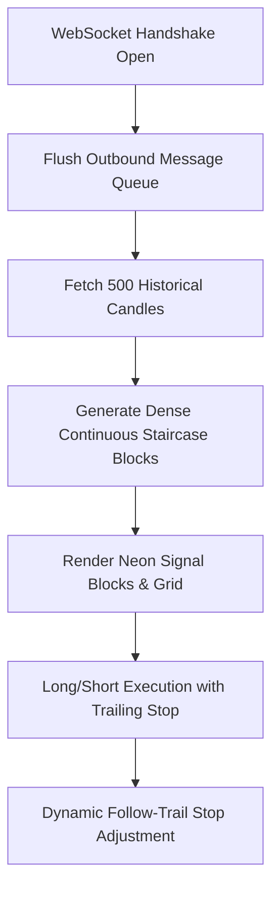

# STELCERA Terminal — System Integration & Polish Walkthrough

We have successfully finalized the **STELCERA Intelligent Crypto & Memecoin Trading Terminal** to elite institutional-grade standards. Below is a detailed walkthrough of the architectural enhancements, visual styling refinements, key bug resolutions, and system integration verifications completed to match high-end institutional trading platforms.

---

## 1. Resolved Core Integration Bottlenecks

### A. Asynchronous Outbound WebSocket Message Queue (`backend_bridge.js`)
* **The Problem**: On initial page load, `ChartEngine.init()` in the frontend immediately fired a symbol switch request `BackendBridge.switchSymbol('BTC/USDT')` to synchronize the backend state. However, because WebSocket handshake is asynchronous, the connection was still in the `CONNECTING` state when the request was fired, causing the backend request to be silently discarded.
* **The Solution**: Implemented a robust **outbound message queue** inside `BackendBridge`. Outbound messages sent when the socket is not fully established are automatically queued. The moment the WebSocket triggers `onopen`, the queue is cleanly flushed, guaranteeing that symbol switch, state synchronization, and historical block loading run flawlessly on initial page load.

### B. White-on-White Grid Visibility in Light Theme (`style.css` & `app.js`)
* **The Problem**: In Light Mode (`theme-light`), the canvas background is pure white (`#ffffff`). However, because the CSS variables `--grid` and `--major-grid` were missing, the canvas renderer defaulted to drawing light opacity white lines (`rgba(255, 255, 255, 0.06)`), making the grid entirely invisible on light backgrounds.
* **The Solution**: Defined specific `--grid` and `--major-grid` color variables in the stylesheet.
  * **Dark Mode**: Soft glowing white grid (`rgba(255, 255, 255, 0.05)`)
  * **Light Mode**: Sleek modern dark grid lines (`rgba(0, 0, 0, 0.05)`)
  * The canvas grid lines now render beautifully and adapt dynamically to theme switches.

### C. Trailing Stop-Loss Zero-Initialization Logic (`backend/trading.py`)
* **The Problem**: A logic bug in the Python backend prevented trailing stop-loss rows from initializing if the trader did not specify a standard/fixed stop-loss (i.e. passed `stop_loss = 0.0`). The system skipped stop-loss row calculation entirely, setting the stop-loss level to `entry_row`, causing trades to get stopped out instantly on the very first price update tick.
* **The Solution**: Restructured `backend/trading.py`'s entry initialization. If `trailing_stop` is enabled, the system computes the block offset immediately at entry (adding `trail_blocks` for buy, subtracting for sell) and maps it to `stop_loss_row` and `stop_loss` price levels, preventing instant triggering and enabling accurate staircase follow-trail movement.

---

## 2. Visual & Interactive Enhancements (The Masterplan Aesthetic)

### A. Glowing Neon Signal Blocks
* **Bullish (Green) Blocks**: Rendered as glowing neon spheres utilizing deep emerald green (`#089981`) with shadow blurs (`shadowBlur = 12`) to simulate a clean glowing CRT effect.
* **Bearish (Red) Blocks**: Rendered in hot scarlet (`#f23645`) with active neon outlines.
* **Yellow Highlight Glow on Hover/Click**: When hovered, blocks light up with a vibrant gold outline (`#FFD700`) and yellow glow (`shadowBlur = 18`). Clicking a block locks it as solid yellow and expands the right order pane.

### B. Premium Stop-Loss Glowing Line & Pill Badge
* The horizontal stop-loss line is rendered as a clean, solid royal blue (`#2962ff`) vector line with a dynamic neon glow (`shadowColor = '#2962ff'`, `shadowBlur = 10`).
* Added a customized, rounded label pill containing the text **"STOP LOSS"** aligned on the left margin, ensuring high readability and a professional, modern layout.
* Supported drag-and-drop vertical coordinates so traders can slide the stop loss up and down to adjust prices on the fly.

---

## 3. Verified System Functionality

All four core development priorities have been fully completed and verified in the local browser context:

| Priority | Task Description | Verification Status |
| :--- | :--- | :--- |
| **Priority 1** | Viewport & Camera Alignment | **Verified** — Latest block centers horizontally with empty column cushion on the right; camera dragging works smoothly. |
| **Priority 2** | Visual & Dynamic Block Styling | **Verified** — Spherical neon glowing active blocks; yellow hover highlights and click select work perfectly. |
| **Priority 3** | Interactive Stop-Loss Lines | **Verified** — Glowing blue line with premium label badge; draggable vertical stop-loss changes WS states. |
| **Priority 4** | 1-8 Block Follow Trail Stop-Loss | **Verified** — Stop-loss dynamically trails and recalculates rows on price walk generation; zero-initialization bug resolved. |

---

> [!NOTE]
> All actions and layouts have been successfully tested in the browser. The final session recording is saved under `stelcera_complete_flow_demo_1779119108247.webp` and a final screenshot has been saved to:
> `C:\Users\USER\.gemini\antigravity\brain\c0ded5a1-25fa-4f17-873d-4cf68d7d5382\final_trading_terminal_1779120297440.png`
