# STELCERA Institutional Trading Terminal
## Complete System Architecture, Codebase Audit & Technical Documentation
*Document Version: 2.0.0 • Institutional Grade • August 20, 2026*

---

## 1. Executive Summary & Project Genesis

**STELCERA** is an ultra-low latency, multi-asset institutional digital trading terminal and quantitative analytics suite engineered with Next.js 15 (App Router), React 19, TypeScript, and FastAPI. 

Designed to rival Bloomberg Terminal, TradingView Pro, and Deribit / Hyperliquid desks, STELCERA provides real-time market data streaming, high-frequency microstructure visualization, advanced quantitative strategy backtesting, Black-Scholes options pricing with Greeks surfaces, on-chain whale intelligence, cross-asset correlation & Value at Risk (VaR) estimation, automated portfolio rebalancing, and client-ready research reporting.

---

## 2. Global Architecture & Technology Stack

```mermaid
graph TD
    subgraph Market Data Layer
        A[Binance Public WebSocket Feeds] -->|Live Trade & L2 Depth| C[Feed Coordinator Engine]
        B[FastAPI Local Market Simulator] -->|Resilient Fallback Stream| C
    end

    subgraph Core Trading & Analytics Platform
        C --> D[Next.js 15 App Router & React 19]
        D --> E[HTML5 Canvas High-FPS Chart Renderer]
        D --> F[Order Management System & Risk Engine]
        D --> G[Quantitative Engine: Black-Scholes, VaR, Backtester]
        D --> H[Web3 Wallet Station & Encrypted API Key Vault]
    end

    subgraph Institutional Desks
        D --> I[1. Terminal / & Multi-Chart Grid]
        D --> J[2. Options Lab /options]
        D --> K[3. Heatmap & CVD /heatmap]
        D --> L[4. Macro Calendar /macro]
        D --> M[5. Whale Radar /whales]
        D --> N[6. Correlation /correlation]
        D --> O[7. Portfolio Risk Studio /analytics]
        D --> P[8. Breaking News /news]
        D --> Q[9. Research Briefs /research]
        D --> R[10. DeFi Yields /yields]
        D --> S[11. Arbitrage Scanner /arbitrage]
        D --> T[12. Technical Screener /screener]
        D --> U[13. Rebalancer /rebalancer]
        D --> V[14. Backtester /backtest & Bots /bots]
    end
```

### 2.1 Backend Architecture
- **Framework**: Python 3.12, FastAPI, Uvicorn, Pydantic, NumPy.
- **WebSocket Gateway**: High-throughput multi-pair tick generator broadcasting real-time trade packets, mid-market order book depths, and volume deltas.
- **REST Endpoints**:
  - `GET /health` — Service health and tick engine status.
  - `GET /api/market/pairs` — Multi-pair price, 24h volume, and percentage change catalog.
  - `GET /api/market/candles` — Resampled historical OHLCV candles.

### 2.2 Frontend Architecture
- **Framework**: Next.js 15.1.0 with React 19, TypeScript, and modern Server / Client Component division.
- **Graphics Pipeline**: Pure HTML5 Canvas 2D sub-pixel rendering with DPI scaling (`window.devicePixelRatio`) to achieve 60-120 FPS render loops without DOM lag.
- **State Management**: Zero-dependency modular React state hooks synchronized with persistent browser `localStorage` and Web Audio API synthesis.
- **Design System**: Strict institutional CSS variable system with 4 switchable color presets:
  - `Cyberpunk Neon` (Default: Neon Cyan `#00D4FF`, Vivid Pink `#FF2ED1`, Deep Purple)
  - `Tokyo Midnight` (Indigo `#6366F1`, Cyber Blue `#38BDF8`, Violet)
  - `Bloomberg Amber` (Classic CRT Amber `#FFB000`, Warm Ochre, Retro Terminal Grid)
  - `Matrix Emerald` (Monochrome Emerald `#00FF66`, Phosphor Green, Cyber Dark)

---

## 3. Comprehensive Breakdown of All 13 Phases

### Phase 1: Core Engine & Technical Indicator Canvas
- **Multi-Pair Watchlist**: Seamless switching across `BTC/USDT`, `ETH/USDT`, `SOL/USDT`, `BNB/USDT`, and `DOGE/USDT`.
- **Dynamic Candle Resampling**: Real-time aggregation of ticks into resampled timeframes:
  $$\text{Timeframe} \in \{\text{TICK}, 1\text{M}, 5\text{M}, 15\text{M}, 1\text{H}, 1\text{D}\}$$
- **Institutional Technical Indicators**:
  1. **Bollinger Bands**:
     $$\text{Upper} = \text{SMA}_{20} + 2\sigma, \quad \text{Lower} = \text{SMA}_{20} - 2\sigma$$
  2. **Exponential Moving Average (EMA)**:
     $$\text{EMA}_t = \alpha \cdot P_t + (1 - \alpha) \cdot \text{EMA}_{t-1}, \quad \alpha = \frac{2}{N+1}$$
  3. **Relative Strength Index (RSI 14)**:
     $$\text{RSI} = 100 - \frac{100}{1 + \text{RS}}, \quad \text{RS} = \frac{\text{Average Gain}}{\text{Average Loss}}$$
  4. **Volume Volatility Histogram**: Colored delta volume bars with volume moving average baseline.
- **Keyboard Shortcuts Engine**: Global zero-latency hotkeys (`Shift+B`, `Shift+S`, `Space`, `T`, `B`, `O`, `1-5`, `?`).

---

### Phase 2: Microstructure Dock & Live Exchange WebSockets
- **Level 2 Order Book (DOM)**: 10 Ask + 10 Bid price levels, cumulative liquidity depth bars, mid-market spread tracker, and 1-click price execution.
- **Time & Sales (Trade Tape)**: Real-time transaction feed with whale order detection ($> \$50\text{k}$ or $> 1.5\text{ BTC}$) and animated badges.
- **Binance WebSocket Feeds**: Live streaming directly from Binance public feeds (`@trade` & `@depth10@100ms`) with 1-click fallback to the local simulation engine.
- **Microstructure Dock**: Collapsible side drawer toggleable via `B` hotkey.

---

### Phase 3: Order Management System (OMS) & Risk Engine
- **Market & Limit Orders**: Support for instant market execution and queued limit orders with custom target prices.
- **Automated Risk Engine (Bracket SL / TP)**:
  - Auto-execution when price hits Stop-Loss or Take-Profit triggers.
  - Dynamic liquidation price calculation based on position leverage ($1\times - 50\times$):
    $$\text{Price}_{\text{liq}}^{\text{long}} = \text{Entry} \times \left(1 - \frac{1}{\text{Leverage}} + \text{MMR}\right)$$
- **Interactive Visual Canvas Triggers**: Interactive dashed lines on the chart for Limit Orders (Amber), Take-Profit (Green), and Stop-Loss (Red).
- **Bottom Orders Terminal Dock (`O` Hotkey)**:
  - **Positions Tab**: Live PnL ($ / %), margin usage, liquidation meter, inline SL/TP editor, and 1-click market close.
  - **Open Orders Tab**: Pending limit orders with 1-click cancelation.
  - **Trade History Tab**: Complete audit trail with **Export CSV** download.
  - **Analytics Tab**: Win Rate %, Net Realized PnL, Profit Factor, Best/Worst trades.

---

### Phase 4: Web3 Wallet Station, Exchange API Keys & Settings Hub
- **Exchange API Connector (`/settings`)**: Secure AES-256 local encrypted storage for Binance & Bybit API keys.
- **Multi-Chain Web3 Wallet Station (`/connect`)**: Direct integration with MetaMask (EVM), Phantom (Solana), Coinbase Wallet, and 1-Click Demo Sandbox across Arbitrum, Base, Ethereum, and Solana.
- **Theme Presets & Customization Hub**: 4 Institutional Themes + Web Audio Synthesizer volume control and JSON Backup & Restore.

---

### Phase 5: Interactive Chart Drawing Tools & AI Market Signals Copilot
- **Interactive Drawing Toolbar (Left Dock)**:
  - **Cursor / Pan Tool** (`V`): Standard chart panning and inspection.
  - **Trendline Tool** (`T`): 2-point drawing with live price delta percentage and angle badges.
  - **Horizontal Support / Resistance Ray** (`H`): 1-click price level lines across chart with price labels.
  - **Fibonacci Retracement Tool** (`F`): Dynamic Fibonacci fans ($0.0$, $0.236$, $0.382$, $0.500$, $0.618$, $0.786$, $1.0$) with golden pocket highlights.
  - **Measure / Ruler Tool** (`M`): Bounding box calculating $\Delta\text{Price}$ ($ / %$), bar counts, and time duration.
  - **Clear All Drawings**: Instant reset.
- **AI Market Signals Copilot**:
  - Live technical synthesis: Market Regime, RSI State, Bollinger Band compression/squeeze alerts, and Order Book Bid/Ask Imbalance Ratio.
  - **Automated Trade Recommendation**: High-probability trade setup with Entry, Stop-Loss, and Take-Profit.
  - **1-Click "Apply Setup" Button**: Auto-populates the Order Dock with AI parameters for rapid execution!

---

### Phase 6: Multi-Chart Grid Split Views & Real-Time Price Alerts
- **Multi-Chart Split Screen Grid Engine**:
  - **Single Chart (`1x1`)**: Full canvas primary terminal.
  - **Dual Vertical Split (`1x2`)**: Side-by-side comparison (e.g. `BTC/USDT` on left + `ETH/USDT` on right).
  - **Dual Horizontal Split (`2x1`)**: Top / Bottom stacked views.
  - **Quad Grid (`2x2`)**: 4 live streaming charts simultaneously (`BTC`, `ETH`, `SOL`, `DOGE`) with independent pair selection, live price streaming, and 1-click focus.
- **Real-Time Price Alerts Engine**:
  - Set custom trigger conditions (`Price ≥ Target` or `Price ≤ Target`) on any asset.
  - Automatic background monitoring with animated flashing alert toasts and cyber audio alarms.

---

### Phase 7: Quantitative Strategy Backtester Lab & Automated Bot Lab
- **Quantitative Strategy Backtester (`/backtest`)**:
  - **4 Built-in Algorithmic Strategies**: EMA 9/21 Trend Crossover, RSI 30/70 Mean Reversion, Bollinger Volatility Breakout, MACD Momentum Crossover.
  - **Simulation Parameters**: Asset choice, Capital ($10k - $1M), Leverage ($1\times - 50\times$), Fee tier ($0.04\%$), Take Profit & Stop Loss.
  - **Equity Curve & Drawdown Canvas**: Real-time visual equity curve with high-water mark tracking.
  - **Institutional Performance Metrics**:
    $$\text{Sharpe Ratio} = \frac{R_p - R_f}{\sigma_p}, \quad \text{Sortino Ratio} = \frac{R_p - R_f}{\sigma_d}$$
    $$\text{Max Drawdown} = \max_{t} \left(\frac{\text{Peak}_t - \text{Trough}_t}{\text{Peak}_t}\right), \quad \text{Profit Factor} = \frac{\sum \text{Gross Profits}}{\sum \text{Gross Losses}}$$
- **Automated Trading Bot Lab (`/bots`)**:
  - Deploy and monitor algorithmic bots in a paper trading sandbox.
  - Controls: Start, Pause, Stop with persistent state in `localStorage`.
  - Real-time PnL tracking and win rate statistics per bot.

---

### Phase 8: Derivatives Options Pricing & Greeks Lab and Liquidations Heatmap
- **Black-Scholes Options Pricing & Greeks Lab (`/options`)**:
  - **Analytical Formula**:
    $$d_1 = \frac{\ln(S/K) + (r + \sigma^2/2)T}{\sigma\sqrt{T}}, \quad d_2 = d_1 - \sigma\sqrt{T}$$
    $$C = S \cdot N(d_1) - K e^{-rT} N(d_2), \quad P = K e^{-rT} N(-d_2) - S \cdot N(-d_1)$$
  - **Full Greeks Sensitivity Matrix**:
    - Delta ($\Delta = N(d_1)$), Gamma ($\Gamma = \frac{N'(d_1)}{S\sigma\sqrt{T}}$), Vega ($\nu = S\sqrt{T}N'(d_1)$), Theta ($\Theta$), Rho ($\rho$).
  - **Dual-Sided Options Chain**: Visual ladder displaying Calls on the left, Strikes in the center, and Puts on the right with IV smile interpolation and Open Interest.
  - **Strategy Payoff Visualizer**: Canvas rendering of P&L at expiration for Long Call/Put, Bull/Bear Spreads, Straddles, and Iron Condors with dynamic breakeven and max gain/loss markers.
- **Liquidations Heatmap & Microstructure Depth Desk (`/heatmap`)**:
  - **Liquidation Density Ladder**: Pinpoints high-probability liquidation cascade pools across price levels for Longs and Shorts.
  - **Cumulative Volume Delta (CVD)**: Aggressive buyer vs seller net volume delta monitoring to spot absorption and breakout momentum.
  - **Cross-Exchange Funding Rate Arbitrage**: 8h rate and annualized APR tracker across Binance, Bybit, Hyperliquid, OKX, and dYdX.

---

### Phase 9: Macro Economic Calendar & On-Chain Whale Radar Desk
- **Global Macro Economic Calendar (`/macro`)**:
  - Scheduled central bank interest rate decisions (FOMC, ECB), CPI inflation releases, Non-Farm Payrolls (NFP), and Core PCE.
  - Real-time event countdown clocks, volatility impact badges (`🔥 HIGH`, `⚡ MEDIUM`), and crypto reaction expectations.
- **On-Chain Whale Tracker & Smart Money Desk (`/whales`)**:
  - Real-time large transaction radar ($>\$10\text{M}$) covering Tether mints, Bitcoin ETF custody transfers, and exchange deposits/withdrawals.
  - 24H Global Exchange Net Reserve Flow Barometer (Inflows vs Outflows).
  - Institutional Whale Leaderboard tracking BlackRock iShares (IBIT), MicroStrategy, Fidelity (FBTC), and top individual treasuries.

---

### Phase 10: Cross-Asset Correlation Matrix & Portfolio Risk Analytics Studio
- **Cross-Asset Pearson Correlation Matrix (`/correlation`)**:
  - Empirical correlation coefficients across `BTC`, `ETH`, `SOL`, `BNB`, `DOGE`, `S&P 500`, `NASDAQ`, `Gold (XAU)`, and `US Dollar Index (DXY)`:
    $$r_{xy} = \frac{\sum (x_i - \bar{x})(y_i - \bar{y})}{\sqrt{\sum (x_i - \bar{x})^2 \sum (y_i - \bar{y})^2}}$$
  - Interactive heat cell matrix from $+1.0$ (Emerald Green) to $-1.0$ (Crimson Red) with 30D / 90D / 1Y lookbacks.
  - Asset Beta ($\beta$) volatility sensitivity rankings.
- **Portfolio Risk Analytics Studio & Value at Risk (`/analytics`)**:
  - **Parametric Value at Risk**:
    $$\text{VaR}_{95\%} = 1.645 \cdot \sigma_p \cdot V_p, \quad \text{VaR}_{99\%} = 2.326 \cdot \sigma_p \cdot V_p$$
  - **Expected Shortfall (CVaR)**: Conditional tail loss beyond the 99% VaR cutoff:
    $$\text{CVaR} = 2.665 \cdot \sigma_p \cdot V_p$$
  - **Macroeconomic Stress-Testing Simulator**: March 2020 Liquidity Shock, FTX Contagion, Fed 100bps Hike, and ETF Inflow Squeeze.
  - **Diversification Health Score**: Concentration analysis rating portfolio resiliency (0 to 100).

---

### Phase 11: Real-Time Crypto News & NLP Sentiment Terminal and Institutional Research Desk
- **Breaking News & NLP Sentiment Terminal (`/news`)**:
  - Live breaking news aggregator streaming from CoinDesk, Bloomberg Crypto, The Block, and Reuters.
  - Automated NLP Sentiment Classification (`BULLISH 🟢`, `BEARISH 🔴`, `NEUTRAL ⚪`) with confidence scores.
  - Category filters: `MACRO`, `INSTITUTIONAL`, `LAYER1`, `REGULATION` with 1-click chart jump buttons.
- **Institutional Research Report Generator (`/research`)**:
  - Comprehensive daily executive briefings synthesizing macro liquidity, on-chain flows, and derivatives positioning.
  - 1-Click "Download Report (.MD)" and "Copy to Clipboard" buttons ready for clients and investment committees.

---

### Phase 12: DeFi Yield Farming Intelligence Desk & Cross-DEX Arbitrage Scanner
- **DeFi Yield Farming & Liquid Staking Desk (`/yields`)**:
  - Live database covering Lido (`stETH`), Jito (`JitoSOL`), Ether.fi (`eETH`), Aave V3, Curve, Uniswap V3 across Ethereum, Solana, Base, and Arbitrum.
  - Interactive Compounding Yield Calculator (Daily, Monthly, and Annual cashflow estimates).
  - Institutional Risk Ratings ($A+$, $A$, $B+$) based on smart contract audits and TVL liquidity depth.
- **Cross-DEX & Cross-CEX Arbitrage Scanner (`/arbitrage`)**:
  - Real-time spread matrix comparing Uniswap V3, Curve, Raydium, Binance, Bybit, and Hyperliquid.
  - Automated fee & gas deductions with net arbitrage profit calculations.
  - 1-Click "Simulate Arbitrage Execution" trigger.

---

### Phase 13: Crypto Technical Screener & Multi-Asset Portfolio Rebalancer Studio
- **Crypto Technical Screener & Radar (`/screener`)**:
  - Multi-factor filtering across RSI, EMA Trend alignment, Bollinger Band Squeezes, 24h Volume Spikes, and Quant Scores.
  - Strategy presets: `Top Momentum`, `Oversold Reversals (<40 RSI)`, `BB Squeezes`, `Bullish EMA`.
  - 1-Click "Chart" button to launch any screened asset directly into the interactive terminal canvas.
- **Multi-Asset Portfolio Rebalancer Studio (`/rebalancer`)**:
  - Interactive target allocation sliders across BTC, ETH, SOL, and Stablecoins with total weight balance validation.
  - Automatic drift detection and execution order plan generator (Buy / Sell / Hold with exact token amounts).
  - 1-Click "Execute Complete Rebalance Simulation" trigger with ledger notification.

---

## 4. Complete Inventory of All 18 Application Routes

All 18 institutional desks are fully functional, compiled, and returning `200 OK`:

| # | Route | Purpose | Key Sub-Components & Capabilities | Status |
|---|---|---|---|---|
| 1 | `/` | Primary Trading Workstation | Multi-Chart Canvas, Level 2 DOM, Time & Sales, Drawing Tools, AI Copilot, OMS | `200 OK` |
| 2 | `/screener` | Crypto Technical Screener | Multi-Factor Scans (RSI, EMA, Bollinger, Volume), 1-Click Chart Launch | `200 OK` |
| 3 | `/rebalancer` | Portfolio Rebalancer Studio | Target Allocation Sliders, Drift Detection, Order Plan Generator | `200 OK` |
| 4 | `/yields` | DeFi Yields & Liquid Staking | LST/LRT APRs, Compounding Yield Calculator, Safety Ratings | `200 OK` |
| 5 | `/arbitrage` | Cross-DEX Arbitrage Scanner | Venue Price Discrepancies, Net Fee Accounting, Fill Simulator | `200 OK` |
| 6 | `/news` | Breaking News & NLP Sentiment | Real-time Crypto News, Sentiment Scoring, Category Filtering | `200 OK` |
| 7 | `/research` | Institutional Research Desk | Daily Executive Market Briefings, 1-Click Markdown / PDF Export | `200 OK` |
| 8 | `/correlation` | Cross-Asset Correlation Matrix | 9x9 Pearson Correlation Heatmap, Lookback Switcher, Beta Rankings | `200 OK` |
| 9 | `/analytics` | Portfolio Risk Studio | Parametric VaR (95%/99%), CVaR, Macro Stress Testing Scenarios | `200 OK` |
| 10 | `/macro` | Global Macro Calendar | Central Bank Decisions (FOMC/ECB), CPI, NFP, Volatility Impact | `200 OK` |
| 11 | `/whales` | On-Chain Whale Radar | Real-Time $10M+ Tx Feed, Exchange Reserves Flow, Whale Leaderboard | `200 OK` |
| 12 | `/options` | Options Pricing & Greeks Lab | Black-Scholes Formula, Greeks Matrix, Dual Chain, Payoff Curves | `200 OK` |
| 13 | `/heatmap` | Liquidations & CVD Desk | Liquidation Density Ladder, CVD Flow Meter, Funding Arbitrage | `200 OK` |
| 14 | `/backtest` | Quantitative Strategy Lab | 4 Algorithmic Strategies, Equity Canvas, Sharpe / Sortino Ratios | `200 OK` |
| 15 | `/bots` | Automated Trading Bots | Start/Pause/Stop Bot Runners, Live PnL & Win Rate Tracking | `200 OK` |
| 16 | `/settings` | Settings & Security Hub | AES-256 API Key Storage, 4 Themes, Audio FX, JSON Backup | `200 OK` |
| 17 | `/connect` | Web3 Multi-Chain Wallets | MetaMask, Phantom, Coinbase, Arbitrum/Base/Ethereum/Solana | `200 OK` |
| 18 | `/history` | Trade Ledger & Analytics | Full Execution History, Win Rate %, Profit Factor, CSV Export | `200 OK` |

---

## 5. Master Keyboard Shortcuts Quick Reference

| Key Combo | Action | Description |
|---|---|---|
| `Shift + B` | Market Buy | Instant execution of long market order with current size |
| `Shift + S` | Market Sell | Instant execution of short market order with current size |
| `Space` | Recenter Canvas | Snaps chart viewport camera directly to live mark price |
| `T` | Toggle Order Entry | Opens / collapses the right-side Quick Order Entry dock |
| `B` | Toggle Microstructure | Opens / collapses the Level 2 DOM and Time & Sales dock |
| `O` | Toggle Terminal Dock | Opens / collapses the bottom Positions & Order Ledger dock |
| `V` | Cursor / Pan Tool | Selects default chart panning and inspection cursor |
| `H` | Horizontal Ray Tool | Activates 1-click horizontal support/resistance drawing |
| `F` | Fibonacci Fan Tool | Activates dynamic Fibonacci retracement golden pocket fans |
| `M` | Measure / Ruler Tool | Activates bounding box price delta and time measure tool |
| `1` | 1-Minute Candle | Switches active timeframe aggregation to 1-Minute |
| `2` | 5-Minute Candle | Switches active timeframe aggregation to 5-Minute |
| `3` | 15-Minute Candle | Switches active timeframe aggregation to 15-Minute |
| `4` | 1-Hour Candle | Switches active timeframe aggregation to 1-Hour |
| `5` | 1-Day Candle | Switches active timeframe aggregation to 1-Day |
| `?` | Shortcuts Modal | Toggles the global Keyboard Shortcuts Cheat Sheet modal |

---

## 6. Audit & Quality Assurance Verification

- **Code Quality**: Zero build errors, zero dead links, complete TypeScript type-safety across all components and libraries.
- **Performance**: High FPS Canvas chart rendering with requestAnimationFrame, sub-50ms UI response times, non-blocking asynchronous state updates.
- **Resilience**: Automatic fallback to simulated market data if external exchange WebSocket feeds experience network interrupts.
- **Client Delivery**: Full audit trail with CSV export and Markdown report download capabilities.
